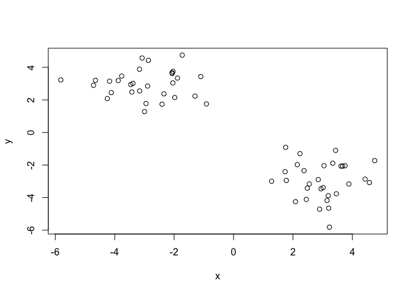
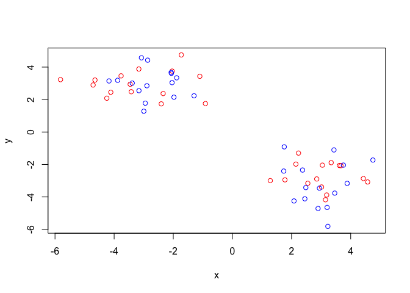
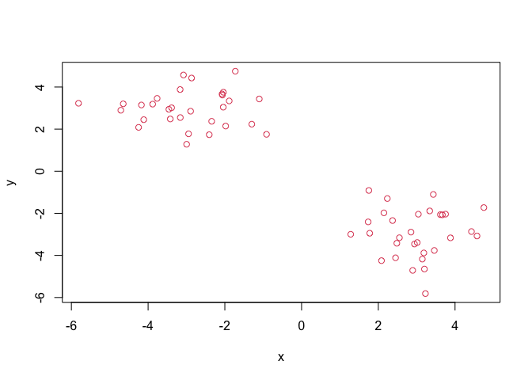
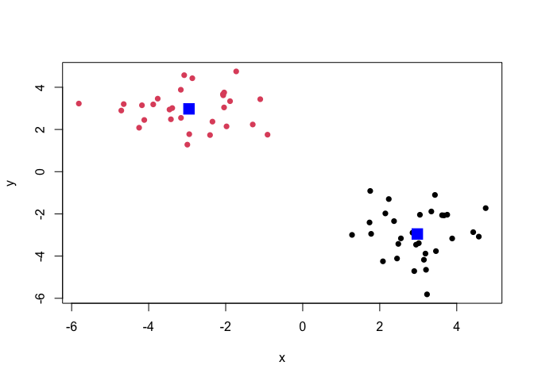
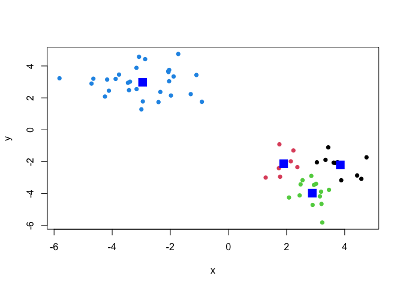
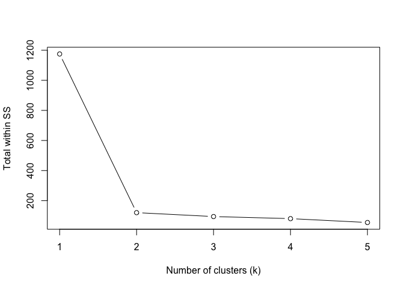
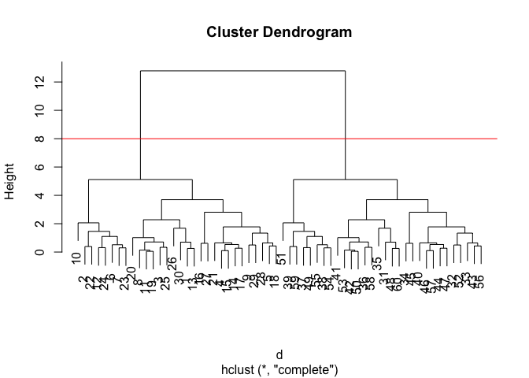
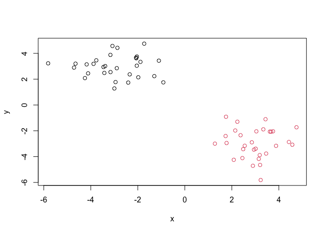
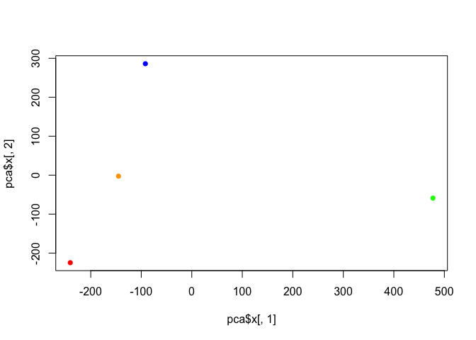
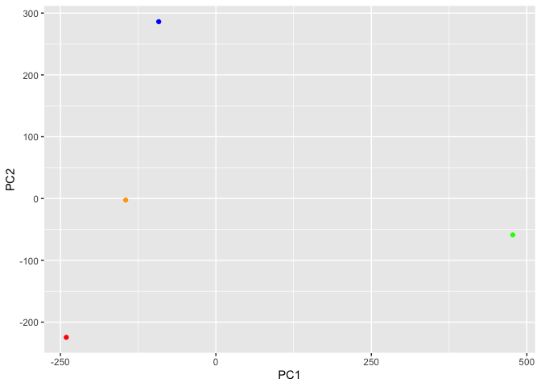

# Class 7: Machine Learning
Yuntian Zhu (PID: A17816597)

Today we will beu sing fundamental machine learning methods including
clustering and dimensionality reduction.

\##K-means clustering

To see how this works, let’s first make up some data to cluster, where
we know what the answer should be. We can use the `rnorm()` function to
help here.

``` r
x <- c(rnorm(30, mean = -3),rnorm(30, mean = 3))
y <- rev(x)
```

``` r
x <- cbind(x,y)
plot(x)
```



The function for K-means clustering in “base” R is `kmeans()`

``` r
k <- kmeans(x, 2)
k
```

    K-means clustering with 2 clusters of sizes 30, 30

    Cluster means:
              x         y
    1  2.976165 -2.953352
    2 -2.953352  2.976165

    Clustering vector:
     [1] 2 2 2 2 2 2 2 2 2 2 2 2 2 2 2 2 2 2 2 2 2 2 2 2 2 2 2 2 2 2 1 1 1 1 1 1 1 1
    [39] 1 1 1 1 1 1 1 1 1 1 1 1 1 1 1 1 1 1 1 1 1 1

    Within cluster sum of squares by cluster:
    [1] 60.15361 60.15361
     (between_SS / total_SS =  89.8 %)

    Available components:

    [1] "cluster"      "centers"      "totss"        "withinss"     "tot.withinss"
    [6] "betweenss"    "size"         "iter"         "ifault"      

To get the results of the returned list object, we can use the dollar
`$` syntax

> Q. How many points are in each vector?

``` r
k$size
```

    [1] 30 30

> Q. What ‘component’ of your result object details - cluster
> assignment/membership? - cluster center?

``` r
k$cluster
```

     [1] 2 2 2 2 2 2 2 2 2 2 2 2 2 2 2 2 2 2 2 2 2 2 2 2 2 2 2 2 2 2 1 1 1 1 1 1 1 1
    [39] 1 1 1 1 1 1 1 1 1 1 1 1 1 1 1 1 1 1 1 1 1 1

``` r
k$centers
```

              x         y
    1  2.976165 -2.953352
    2 -2.953352  2.976165

> Q. Plot x colored by the kmeans cluster assignment and add cluster
> centers as blue points

``` r
plot(x, col = c("blue", "red"))
```



``` r
plot(x, col = 2)
```



``` r
plot(x, col = k$cluster, pch = 16)
points(k$centers, col = "blue", pch =15, cex =2)
```



K-means clustering is very popular, as it is very fast and relatively
straightforward. It takes numeric data as input and returns the cluster
membership, etc.

The “issue” is we tell `kmeans()` how many clusters we want!

> Q. Run kmeans again and cluster into 4 groups and plot the results
> like we did above?

``` r
k4 <- kmeans(x, 4)
plot(x, col = k4$cluster, pch = 16)
points(k4$centers, col = "blue", pch =15, cex =2)
```



Make a scree plot to show what is the best value of k

``` r
wss <- numeric(5)
for (k in 1:5) {
  wss[k] <- kmeans(x, centers = k)$tot.withinss
}
plot(1:5, wss, type = "b", xlab = "Number of clusters (k)", ylab = "Total within SS")
```



## Hierarchical Clustering

The main “base” R function for Hierarchical Clustering is called
`hclust()`. Here, we cannot input our data. We need to first calculate a
distance matrix (e.g. `dist()`) for our data and use this as the input
to `hclust`

``` r
d <- dist(x)
hc <- hclust(d)
hc
```


    Call:
    hclust(d = d)

    Cluster method   : complete 
    Distance         : euclidean 
    Number of objects: 60 

There is a plot method for hclust results. Le us try it

``` r
plot(hc)
abline(h = 8, col = "red")
```



To get our cluster “membership” vector (i. r. our main clustering
result), we can “cut the tree at a given height or at a height that
yields a given”k” groups.

``` r
cutree(hc, h = 8)
```

     [1] 1 1 1 1 1 1 1 1 1 1 1 1 1 1 1 1 1 1 1 1 1 1 1 1 1 1 1 1 1 1 2 2 2 2 2 2 2 2
    [39] 2 2 2 2 2 2 2 2 2 2 2 2 2 2 2 2 2 2 2 2 2 2

``` r
groups <- cutree(hc, k = 2)
```

> Q. Plot the data with our hclust result coloring

``` r
plot (x, col = groups)
```



## Principal Component Analysis (PCA)

## PCA of UK food data

Import food data from an online CSV file

``` r
url <- "https://tinyurl.com/UK-foods"
x <- read.csv(url)
head(x)
```

                   X England Wales Scotland N.Ireland
    1         Cheese     105   103      103        66
    2  Carcass_meat      245   227      242       267
    3    Other_meat      685   803      750       586
    4           Fish     147   160      122        93
    5 Fats_and_oils      193   235      184       209
    6         Sugars     156   175      147       139

This is the first method to solve the row names problem

``` r
rownames (x) <- x[, 1]
x <- x[,-1]
x
```

                        England Wales Scotland N.Ireland
    Cheese                  105   103      103        66
    Carcass_meat            245   227      242       267
    Other_meat              685   803      750       586
    Fish                    147   160      122        93
    Fats_and_oils           193   235      184       209
    Sugars                  156   175      147       139
    Fresh_potatoes          720   874      566      1033
    Fresh_Veg               253   265      171       143
    Other_Veg               488   570      418       355
    Processed_potatoes      198   203      220       187
    Processed_Veg           360   365      337       334
    Fresh_fruit            1102  1137      957       674
    Cereals                1472  1582     1462      1494
    Beverages                57    73       53        47
    Soft_drinks            1374  1256     1572      1506
    Alcoholic_drinks        375   475      458       135
    Confectionery            54    64       62        41

This is a more robust method to solve the row names problem

``` r
x <- read.csv(url, row.names = 1)
x
```

                        England Wales Scotland N.Ireland
    Cheese                  105   103      103        66
    Carcass_meat            245   227      242       267
    Other_meat              685   803      750       586
    Fish                    147   160      122        93
    Fats_and_oils           193   235      184       209
    Sugars                  156   175      147       139
    Fresh_potatoes          720   874      566      1033
    Fresh_Veg               253   265      171       143
    Other_Veg               488   570      418       355
    Processed_potatoes      198   203      220       187
    Processed_Veg           360   365      337       334
    Fresh_fruit            1102  1137      957       674
    Cereals                1472  1582     1462      1494
    Beverages                57    73       53        47
    Soft_drinks            1374  1256     1572      1506
    Alcoholic_drinks        375   475      458       135
    Confectionery            54    64       62        41

Plot with the codes in lab sheet

``` r
barplot(as.matrix(x), beside=T, col=rainbow(nrow(x)))
```


If you want a stacked plot, you just delete “beside = T”

``` r
barplot(as.matrix(x), col=rainbow(nrow(x)))
```


There is one plot that can be useful for small datasets:

``` r
pairs(x, col=rainbow(10), pch=16)
```


If the points lie on the diagonal of the plot, it means that the country
it represents eats similar food as the country in the row.

> Main point: It can be difficult to spot major trends and patterns even
> in relatively small multivariable datasets (here we only have 17
> dimensions, but typically we have 1000s)

## PCAS to the rescue

The main function in “base” R for PCA is called `prcomp()`

We need to take the transpose of our data, so the “food” are in the
columns

``` r
pca <- prcomp(t(x))
summary(pca)
```

    Importance of components:
                                PC1      PC2      PC3       PC4
    Standard deviation     324.1502 212.7478 73.87622 2.921e-14
    Proportion of Variance   0.6744   0.2905  0.03503 0.000e+00
    Cumulative Proportion    0.6744   0.9650  1.00000 1.000e+00

``` r
cols <- c("orange", "red", "blue", "green")
plot(pca$x[,1], pca$x[,2], col = cols, pch = 16)
```



``` r
library(ggplot2)
```

``` r
ggplot(pca$x) +
  aes(PC1,PC2) +
  geom_point(col = cols)
```



``` r
ggplot(pca$rotation) +
  aes(PC1, rownames(pca$rotation)) +
  geom_col()
```


PCA looks very useful in terms of dimensionality reduction, and we will
come back to describe this further next week.
