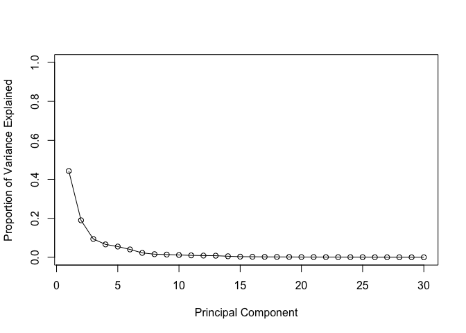
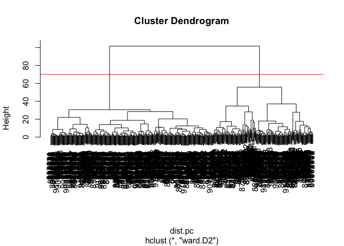
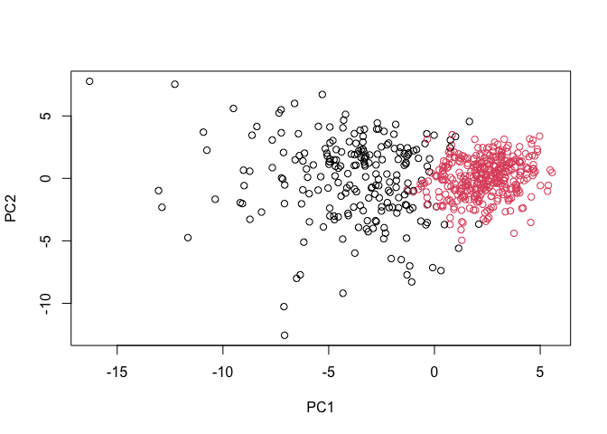
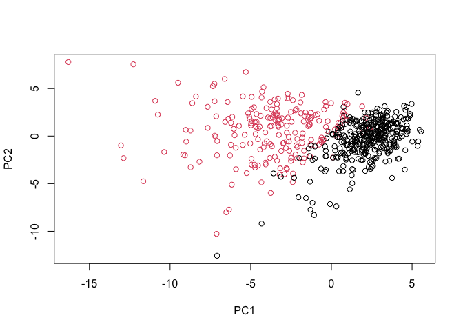

# Class08_Mini-project
Yuntian Zhu (PID: A17816597)

- [Data import](#data-import)
- [Exploratory data analysis](#exploratory-data-analysis)
- [Principal Component Analysis](#principal-component-analysis)
- [Variance explained](#variance-explained)
- [Hierarchical clustering](#hierarchical-clustering)
- [K-means](#k-means)
- [Combining different methods](#combining-different-methods)
- [Sensitivity and Specificity](#sensitivity-and-specificity)
- [Prediction](#prediction)

The goal of this mini-project is for you to explore a complete analysis
using the unsupervised learning techniques covered in class. You’ll
extend what you’ve learned by combining PCA as a preprocessing step to
clustering using data that consist of measurements of cell nuclei of
human breast masses. This expands on our RNA-Seq analysis from last day.
The data itself comes from the Wisconsin Breast Cancer Diagnostic Data
Set first reported by K. P. Benne and O. L. Mangasarian: “Robust Linear
Programming Discrimination of Two Linearly Inseparable Sets”.

Values in this data set describe characteristics of the cell nuclei
present in digitized images of a fine needle aspiration (FNA) of a
breast mass. FNA is a type of biopsy procedure where a very thin needle
is inserted into an area of abnormal tissue or cells with a guide of CT
scan or ultrasound monitors (Figure 1). The collected sample is then
transferred to a pathologist to study it under a microscope and examine
whether cells in the biopsy are normal or not. For example radius
(i.e. mean of distances from center to points on the perimeter), texture
(i.e. standard deviation of gray-scale values), and smoothness (local
variation in radius lengths). Summary information is also provided for
each group of cells including diagnosis (i.e. benign (not cancerous) and
and malignant (cancerous)).

## Data import

I need to first import our data from our class website. After importing
the data, I can check the content of the data and name the data
properly.

``` r
# Save your input data file into your Project directory
fna.data <- "WisconsinCancer.csv"
# Complete the following code to input the data and store as wisc.df
wisc.df <- read.csv(fna.data, row.names=1)
# Create diagnosis vector for later 
diagnosis <- factor(wisc.df$diagnosis)
# We can use -1 here to remove the first column
wisc.data <- wisc.df[, -1]
#View the imported data
head(wisc.data)
```

             radius_mean texture_mean perimeter_mean area_mean smoothness_mean
    842302         17.99        10.38         122.80    1001.0         0.11840
    842517         20.57        17.77         132.90    1326.0         0.08474
    84300903       19.69        21.25         130.00    1203.0         0.10960
    84348301       11.42        20.38          77.58     386.1         0.14250
    84358402       20.29        14.34         135.10    1297.0         0.10030
    843786         12.45        15.70          82.57     477.1         0.12780
             compactness_mean concavity_mean concave.points_mean symmetry_mean
    842302            0.27760         0.3001             0.14710        0.2419
    842517            0.07864         0.0869             0.07017        0.1812
    84300903          0.15990         0.1974             0.12790        0.2069
    84348301          0.28390         0.2414             0.10520        0.2597
    84358402          0.13280         0.1980             0.10430        0.1809
    843786            0.17000         0.1578             0.08089        0.2087
             fractal_dimension_mean radius_se texture_se perimeter_se area_se
    842302                  0.07871    1.0950     0.9053        8.589  153.40
    842517                  0.05667    0.5435     0.7339        3.398   74.08
    84300903                0.05999    0.7456     0.7869        4.585   94.03
    84348301                0.09744    0.4956     1.1560        3.445   27.23
    84358402                0.05883    0.7572     0.7813        5.438   94.44
    843786                  0.07613    0.3345     0.8902        2.217   27.19
             smoothness_se compactness_se concavity_se concave.points_se
    842302        0.006399        0.04904      0.05373           0.01587
    842517        0.005225        0.01308      0.01860           0.01340
    84300903      0.006150        0.04006      0.03832           0.02058
    84348301      0.009110        0.07458      0.05661           0.01867
    84358402      0.011490        0.02461      0.05688           0.01885
    843786        0.007510        0.03345      0.03672           0.01137
             symmetry_se fractal_dimension_se radius_worst texture_worst
    842302       0.03003             0.006193        25.38         17.33
    842517       0.01389             0.003532        24.99         23.41
    84300903     0.02250             0.004571        23.57         25.53
    84348301     0.05963             0.009208        14.91         26.50
    84358402     0.01756             0.005115        22.54         16.67
    843786       0.02165             0.005082        15.47         23.75
             perimeter_worst area_worst smoothness_worst compactness_worst
    842302            184.60     2019.0           0.1622            0.6656
    842517            158.80     1956.0           0.1238            0.1866
    84300903          152.50     1709.0           0.1444            0.4245
    84348301           98.87      567.7           0.2098            0.8663
    84358402          152.20     1575.0           0.1374            0.2050
    843786            103.40      741.6           0.1791            0.5249
             concavity_worst concave.points_worst symmetry_worst
    842302            0.7119               0.2654         0.4601
    842517            0.2416               0.1860         0.2750
    84300903          0.4504               0.2430         0.3613
    84348301          0.6869               0.2575         0.6638
    84358402          0.4000               0.1625         0.2364
    843786            0.5355               0.1741         0.3985
             fractal_dimension_worst
    842302                   0.11890
    842517                   0.08902
    84300903                 0.08758
    84348301                 0.17300
    84358402                 0.07678
    843786                   0.12440

The first column `diagnosis` is the expert opinion on the whether the
tumor is malignant or benign. We remove the column because we do not
want to see it before our data analysis.

## Exploratory data analysis

Now, I can answer some exploratory data analysis questions in the lab
sheet

> Q1. How many observations are in this dataset?

``` r
dim(wisc.df)
```

    [1] 569  31

There are 569 rows in this dataset, which means there are 569 patients
in total. For each patient, there are 31 parameters measured, and this
is why there are 31 columns here (if we include the diagnosis column
here).

> Q2. How many of the observations have a malignant diagnosis?

``` r
table(wisc.df$diagnosis)
```


      B   M 
    357 212 

In total, there are 212 observations having a malignent diagnosis

> Q3. How many variables/features in the data are suffixed with \_mean?

``` r
length(grep("_mean", colnames(wisc.df)))
```

    [1] 10

There are 10 variables/features in the data suffixed with \_mean.

## Principal Component Analysis

The next step of the analysis is to perform PCA.

It is important to check if the data need to be scaled before performing
PCA. Recall two common reasons for scaling data include: 1. The input
variables use different units of measurement. 2. The input variables
have significantly different variances.

``` r
# Check column means and standard deviations
colMeans(wisc.data)
```

                radius_mean            texture_mean          perimeter_mean 
               1.412729e+01            1.928965e+01            9.196903e+01 
                  area_mean         smoothness_mean        compactness_mean 
               6.548891e+02            9.636028e-02            1.043410e-01 
             concavity_mean     concave.points_mean           symmetry_mean 
               8.879932e-02            4.891915e-02            1.811619e-01 
     fractal_dimension_mean               radius_se              texture_se 
               6.279761e-02            4.051721e-01            1.216853e+00 
               perimeter_se                 area_se           smoothness_se 
               2.866059e+00            4.033708e+01            7.040979e-03 
             compactness_se            concavity_se       concave.points_se 
               2.547814e-02            3.189372e-02            1.179614e-02 
                symmetry_se    fractal_dimension_se            radius_worst 
               2.054230e-02            3.794904e-03            1.626919e+01 
              texture_worst         perimeter_worst              area_worst 
               2.567722e+01            1.072612e+02            8.805831e+02 
           smoothness_worst       compactness_worst         concavity_worst 
               1.323686e-01            2.542650e-01            2.721885e-01 
       concave.points_worst          symmetry_worst fractal_dimension_worst 
               1.146062e-01            2.900756e-01            8.394582e-02 

``` r
apply(wisc.data,2,sd)
```

                radius_mean            texture_mean          perimeter_mean 
               3.524049e+00            4.301036e+00            2.429898e+01 
                  area_mean         smoothness_mean        compactness_mean 
               3.519141e+02            1.406413e-02            5.281276e-02 
             concavity_mean     concave.points_mean           symmetry_mean 
               7.971981e-02            3.880284e-02            2.741428e-02 
     fractal_dimension_mean               radius_se              texture_se 
               7.060363e-03            2.773127e-01            5.516484e-01 
               perimeter_se                 area_se           smoothness_se 
               2.021855e+00            4.549101e+01            3.002518e-03 
             compactness_se            concavity_se       concave.points_se 
               1.790818e-02            3.018606e-02            6.170285e-03 
                symmetry_se    fractal_dimension_se            radius_worst 
               8.266372e-03            2.646071e-03            4.833242e+00 
              texture_worst         perimeter_worst              area_worst 
               6.146258e+00            3.360254e+01            5.693570e+02 
           smoothness_worst       compactness_worst         concavity_worst 
               2.283243e-02            1.573365e-01            2.086243e-01 
       concave.points_worst          symmetry_worst fractal_dimension_worst 
               6.573234e-02            6.186747e-02            1.806127e-02 

The variances of different columns are largely different, and different
columns have different units. We need to scale the data before doing
PCA, so that we can get a more informative PCA result. **In general, we
always want to scale the data before performing a PCA, so that the
analysis is not dominated by variables in the dataset with high standard
deviations just because of their units**

The `prcomp()` function is the main function in R to do PCA

``` r
wisc.pr <- prcomp(wisc.data, scale = TRUE)
summary((wisc.pr))
```

    Importance of components:
                              PC1    PC2     PC3     PC4     PC5     PC6     PC7
    Standard deviation     3.6444 2.3857 1.67867 1.40735 1.28403 1.09880 0.82172
    Proportion of Variance 0.4427 0.1897 0.09393 0.06602 0.05496 0.04025 0.02251
    Cumulative Proportion  0.4427 0.6324 0.72636 0.79239 0.84734 0.88759 0.91010
                               PC8    PC9    PC10   PC11    PC12    PC13    PC14
    Standard deviation     0.69037 0.6457 0.59219 0.5421 0.51104 0.49128 0.39624
    Proportion of Variance 0.01589 0.0139 0.01169 0.0098 0.00871 0.00805 0.00523
    Cumulative Proportion  0.92598 0.9399 0.95157 0.9614 0.97007 0.97812 0.98335
                              PC15    PC16    PC17    PC18    PC19    PC20   PC21
    Standard deviation     0.30681 0.28260 0.24372 0.22939 0.22244 0.17652 0.1731
    Proportion of Variance 0.00314 0.00266 0.00198 0.00175 0.00165 0.00104 0.0010
    Cumulative Proportion  0.98649 0.98915 0.99113 0.99288 0.99453 0.99557 0.9966
                              PC22    PC23   PC24    PC25    PC26    PC27    PC28
    Standard deviation     0.16565 0.15602 0.1344 0.12442 0.09043 0.08307 0.03987
    Proportion of Variance 0.00091 0.00081 0.0006 0.00052 0.00027 0.00023 0.00005
    Cumulative Proportion  0.99749 0.99830 0.9989 0.99942 0.99969 0.99992 0.99997
                              PC29    PC30
    Standard deviation     0.02736 0.01153
    Proportion of Variance 0.00002 0.00000
    Cumulative Proportion  1.00000 1.00000

> Q4. From your results, what proportion of the original variance is
> captured by the first principal components (PC1)?

44.27% of the original variance is captured by PC1.

> Q5. How many principal components (PCs) are required to describe at
> least 70% of the original variance in the data?

We need at least three: PC1, PC2 and PC3.

> Q6. How many principal components (PCs) are required to describe at
> least 90% of the original variance in the data?

We need at least seven: PC1, PC2, PC3, PC4, PC5, PC6 and PC7.

The main PC result figure is called a “score plot” or “PC”plot” (it also
has many other names…)

``` r
library(ggplot2)

ggplot(wisc.pr$x) + 
  aes(PC1,PC2, col = diagnosis) +
  geom_point()
```


It can be clearly observed that benign tumors and malignant tumors are
somehow separated by the PCA plot.

We can also try biplot

``` r
biplot(wisc.pr)
```


> Q7. What stands out to you about this plot? Is it easy or difficult to
> understand? Why?

The points in the plot are extremely crowded, and the labels are largely
overlapping with each other. In addition, we are missing the color
coding – the most important feature (malignant vs. begin ) is not even
shown here. Together, these make the plot very difficult to understand.

Previously, we already generated the PCA plot with PC1 and PC2. This
time we can try with PC1 and PC3 and see what is the difference.

> Q8. Generate a similar plot for principal components 1 and 3. What do
> you notice about these plots?

``` r
library(ggplot2)

ggplot(wisc.pr$x) + 
  aes(PC1,PC3, col = diagnosis) +
  geom_point()
```


It can be found that in the plot of PC1 vs PC3, the benign tumors and
malignant tumors are not separated so well as the case in the plot of
PC1 vs PC2. This is because PC3 explains less original variance,
compared with PC2.

## Variance explained

First, let us calculate the variance of each component

``` r
# Calculate variance of each component
pr.var <- wisc.pr$sdev^2
head(pr.var)
```

    [1] 13.281608  5.691355  2.817949  1.980640  1.648731  1.207357

Then, let us calculate the variance explained by each principal
component by dividing by the total variance explained of all principal
components.

``` r
# Variance explained by each principal component: pve
pve <- pr.var / sum(pr.var)

# Plot variance explained for each principal component
plot(pve, xlab = "Principal Component",
     ylab = "Proportion of Variance Explained",
     ylim = c(0, 1), type = "o")
```



We can also use an alternative way to plot the same data

``` r
# Alternative scree plot of the same data, note data driven y-axis
barplot(pve, ylab = "Precent of Variance Explained",
     names.arg=paste0("PC",1:length(pve)), las=2, axes = FALSE)
axis(2, at=pve, labels=round(pve,2)*100 )
```


> Q9. For the first principal component, what is the component of the
> loading vector (i.e. wisc.pr\$rotation\[,1\]) for the feature
> concave.points_mean?

``` r
wisc.pr$rotation["concave.points_mean", "PC1"]
```

    [1] -0.2608538

The component of the loading vector for the feature concave.points_mean
is -0.2608538.

> Q10. What is the minimum number of principal components required to
> explain 80% of the variance of the data?

We need at least five principal components: PC1, PC2, PC3, PC4 and PC5

## Hierarchical clustering

Just clustering the original data is not very informative or helpful

``` r
# Scale the wisc.data data using the "scale()" function
data.scaled <- scale(wisc.data)
#Calculate the (Euclidean) distances between all pairs of observations 
data.dist <- dist(data.scaled)
#Create a hierarchical clustering model using complete linkage. 
wisc.hclust <- hclust(data.dist, "complete")
```

> Q11. Using the plot() and abline() functions, what is the height at
> which the clustering model has 4 clusters?

``` r
plot(wisc.hclust)
abline(h = 19, col="red", lty=2)
```


``` r
table(cutree(wisc.hclust, h = 19))
```


      1   2   3   4 
    177   7 383   2 

When we cut the tree with the height = 19 or 20, the clustering model
has 4 clusters.

With the cutree function, we can select the specific clusters.

``` r
wisc.hclust.clusters <- cutree(wisc.hclust, h = 19)
```

We can use the table() function to compare the cluster membership to the
actual diagnoses.

``` r
table(wisc.hclust.clusters, diagnosis)
```

                        diagnosis
    wisc.hclust.clusters   B   M
                       1  12 165
                       2   2   5
                       3 343  40
                       4   0   2

> Q12. Can you find a better cluster vs diagnoses match by cutting into
> a different number of clusters between 2 and 10?

``` r
wisc.hclust.clusters3 <- cutree(wisc.hclust, k = 3)
table(wisc.hclust.clusters3, diagnosis)
```

                         diagnosis
    wisc.hclust.clusters3   B   M
                        1 355 205
                        2   2   5
                        3   0   2

If we cut the tree into 3 clusters, cluster 1 almost does not reflect
cluster vs diagnoses match at all. Therefore, reducing the cluster
numbers to those smaller than 4 is likely not a good choice.

``` r
wisc.hclust.clusters5 <- cutree(wisc.hclust, k = 5)
table(wisc.hclust.clusters5, diagnosis)
```

                         diagnosis
    wisc.hclust.clusters5   B   M
                        1  12 165
                        2   0   5
                        3 343  40
                        4   2   0
                        5   0   2

If we cut the tree into 5 clusters, this is somewhat better than 4
clusters. When we cut the tree into 4 clusters, cluster 2 contains 2
benign tumors and 5 malignant tumors. When we cut the tree into 5
clusters, the original cluster 2 is now separated to the new cluster 2 –
which contains 5 malignant tumors only – and the new cluster 4, which
contains 2 benign tumors only. However, since the new cluster 2 and new
cluster 4 do not contain that many tumors, the benefit is not that
significant.

``` r
wisc.hclust.clusters10 <- cutree(wisc.hclust, k = 10)
table(wisc.hclust.clusters10, diagnosis)
```

                          diagnosis
    wisc.hclust.clusters10   B   M
                        1   12  86
                        2    0  59
                        3    0   3
                        4  331  39
                        5    0  20
                        6    2   0
                        7   12   0
                        8    0   2
                        9    0   2
                        10   0   1

Finally, let us cut the tree into 10 clusters. This again becomes
somewhat better than 5 clusters, because now there are more clusters
that contain benign tumors only or malignant tumors only. However, as
the case of 5 clusters, these newly created clusters do not contain that
many tumors.

Therefore, my conclusion is that cutting the tree into less clusters
does not work. On the other hand, cutting the tree into more clusters
(up to 10) can help us find more clusters that contain only benign or
only malignant tumors. However, since these newly created clusters have
relatively small sizes, it is not a remarkable benefit.

As we discussed in our last class videos there are number of different
“methods” we can use to combine points during the hierarchical
clustering procedure. These include “single”, “complete”, “average” and
“ward.D2”.

> Q13. Which method gives your favorite results for the same data.dist
> dataset? Explain your reasoning.

My favorite method is the “complete” method. It gives the best results
because it produces more compact, spherical clusters by using the
maximum distance between clusters. This helps avoid the “chaining”
problem seen in single linkage and creates better-separated groups,
which is important for distinguishing between malignant and benign
diagnoses.

## K-means

Let’s also try K-means clustering

``` r
wisc.km <- kmeans(scale(wisc.data), centers=2, nstart=20)
table(wisc.hclust.clusters, wisc.km$cluster)
```

                        
    wisc.hclust.clusters   1   2
                       1 160  17
                       2   7   0
                       3  20 363
                       4   2   0

## Combining different methods

By combining the PCA method and the hierarchical clustering method, we
can better analyze the data.

``` r
#Take the first 7 PCs so that at least 90% of the original variance is captured
dist.pc <- dist(wisc.pr$x[,1:7])
wisc.pr.hclust <- hclust(dist.pc, method = "ward.D2")
```

View the tree…

``` r
plot(wisc.pr.hclust)
abline(h = 70, col = "red")
```



To get our clustering membership vector (i.e. our main clustering
result), we “cut” the tree at a desired height to yield a desired number
of “k” groups.

``` r
grps <-cutree(wisc.pr.hclust, h = 70)
table(grps)
```

    grps
      1   2 
    216 353 

How does this clustering looks compared to the diagnosis from the
experts?

``` r
table(grps, diagnosis)
```

        diagnosis
    grps   B   M
       1  28 188
       2 329  24

Let us plot the clustering result and use the color to encode the groups
we found

``` r
plot(wisc.pr$x[,1:2], col=grps)
```



Make another plot. This time, we use the color to encode the diagnosis
by the experts.

``` r
plot(wisc.pr$x[,1:2], col=diagnosis)
```



We can see that these two plots are largely similar to each other.

Let’s put all the results of all the methods together using the
`table()` function

``` r
#The result of combining PCA and hierarchical clustering
table(grps, diagnosis)
```

        diagnosis
    grps   B   M
       1  28 188
       2 329  24

``` r
# The result of using K-means clustering
table(wisc.km$cluster, diagnosis)
```

       diagnosis
          B   M
      1  14 175
      2 343  37

``` r
# The result of using hierarchical clustering
table(wisc.hclust.clusters, diagnosis)
```

                        diagnosis
    wisc.hclust.clusters   B   M
                       1  12 165
                       2   2   5
                       3 343  40
                       4   0   2

> Q15. How well does the newly created model with four (should actually
> be 2) clusters separate out the two diagnoses?

The 2-cluster model created by combining PCA hierarchical clustering
performs reasonably well at separating the diagnoses with 90.9% overall
accuracy (517/569 correct classifications). Cluster 1: Primarily
Malignant (87% purity) - 188 M, 28 B. Cluster 2: Primarily Benign (93%
purity) - 329 B, 24 M. The model correctly identifies most cases but has
52 misclassifications: 28 Benign cases wrongly grouped with Malignant,
and 24 Malignant cases wrongly grouped with Benign. Cluster 2 shows
better separation than Cluster 1.

> Q16. How well do the k-means and hierarchical clustering models you
> created in previous sections (i.e. before PCA) do in terms of
> separating the diagnoses? Again, use the table() function to compare
> the output of each model (wisc.km\$cluster and wisc.hclust.clusters)
> with the vector containing the actual diagnoses.

K-means clustering: 91.0% accuracy (518/569 correct); Cluster 1: 175 M,
14 B (93% Malignant); Cluster 2: 343 B, 37 M (90% Benign); Total
misclassifications: 51

Hierarchical clustering: 90.5% accuracy (515/569 correct); Cluster 1:
165 M, 12 B (93% Malignant); Cluster 2: 5 M, 2 B (very small, 71%
Malignant the 2 benign tumors are considered as misclassifications);
Cluster 3: 40 M, 343 B (90% Benign); Cluster 4: 2 M, 0 B (very small,
100% Malignant); Total misclassifications: 54

The overall correct rates for all these three methods are very similar
to each other – all around 90%. The method using K-means only performs
slightly better than the other two methods. The method using
hierarchical clustering only creates fragmented clusters with some very
small groups (clusters 2 and 4), making it less practical for diagnosis
separation.

## Sensitivity and Specificity

**Sensitivity** refers to a test’s ability to correctly detect ill
patients who do have the condition. In our example here the sensitivity
is the total number of samples in the cluster identified as
predominantly malignant (cancerous) divided by the total number of known
malignant samples. In other words: TP/(TP+FN).

**Specificity** relates to a test’s ability to correctly reject healthy
patients without a condition. In our example specificity is the
proportion of benign (not cancerous) samples in the cluster identified
as predominantly benign that are known to be benign. In other words:
TN/(TN+FN).

> Q17. Which of your analysis procedures resulted in a clustering model
> with the best specificity? How about sensitivity?

We can get the TP, FN, TN and FP numbers for each of the three methods
using the summary that we wrote above.

``` r
# K-means Clustering
TP_k <- 175
FN_k <- 37
TN_k <- 343
FP_k <- 14

sensitivity_k <- TP_k / (TP_k + FN_k)
specificity_k <- TN_k / (TN_k + FP_k)

# Hierarchical Clustering (4 clusters)
TP_h <- 172
FN_h <- 40
TN_h <- 343
FP_h <- 14

sensitivity_h <- TP_h / (TP_h + FN_h)
specificity_h <- TN_h / (TN_h + FP_h)

# PCA + Hierarchical (2 clusters)
TP_pca <- 188
FN_pca <- 24
TN_pca <- 329
FP_pca <- 28

sensitivity_pca <- TP_pca / (TP_pca + FN_pca)
specificity_pca <- TN_pca / (TN_pca + FP_pca)

# Print results
cat("K-means: Sensitivity =", sensitivity_k, "Specificity =", specificity_k, "\n")
```

    K-means: Sensitivity = 0.8254717 Specificity = 0.9607843 

``` r
cat("Hierarchical: Sensitivity =", sensitivity_h, "Specificity =", specificity_h, "\n")
```

    Hierarchical: Sensitivity = 0.8113208 Specificity = 0.9607843 

``` r
cat("PCA + Hierarchical: Sensitivity =", sensitivity_pca, 
    "Specificity =", specificity_pca, "\n")
```

    PCA + Hierarchical: Sensitivity = 0.8867925 Specificity = 0.9215686 

## Prediction

We can use our PCA model for prediction with new input patient samples.

``` r
url <- "https://tinyurl.com/new-samples-CSV"
new <- read.csv(url)
npc <- predict(wisc.pr, newdata=new)
npc
```

               PC1       PC2        PC3        PC4       PC5        PC6        PC7
    [1,]  2.576616 -3.135913  1.3990492 -0.7631950  2.781648 -0.8150185 -0.3959098
    [2,] -4.754928 -3.009033 -0.1660946 -0.6052952 -1.140698 -1.2189945  0.8193031
                PC8       PC9       PC10      PC11      PC12      PC13     PC14
    [1,] -0.2307350 0.1029569 -0.9272861 0.3411457  0.375921 0.1610764 1.187882
    [2,] -0.3307423 0.5281896 -0.4855301 0.7173233 -1.185917 0.5893856 0.303029
              PC15       PC16        PC17        PC18        PC19       PC20
    [1,] 0.3216974 -0.1743616 -0.07875393 -0.11207028 -0.08802955 -0.2495216
    [2,] 0.1299153  0.1448061 -0.40509706  0.06565549  0.25591230 -0.4289500
               PC21       PC22       PC23       PC24        PC25         PC26
    [1,]  0.1228233 0.09358453 0.08347651  0.1223396  0.02124121  0.078884581
    [2,] -0.1224776 0.01732146 0.06316631 -0.2338618 -0.20755948 -0.009833238
                 PC27        PC28         PC29         PC30
    [1,]  0.220199544 -0.02946023 -0.015620933  0.005269029
    [2,] -0.001134152  0.09638361  0.002795349 -0.019015820

Then, let’s plot the new patients in our original PCA plot.

``` r
plot(wisc.pr$x[,1:2], col=grps)
points(npc[,1], npc[,2], col="blue", pch=16, cex=3)
text(npc[,1], npc[,2], c(1,2), col="white")
```


> Q18. Which of these new patients should we prioritize for follow up
> based on your results?

Patient 2. This is because patient 2 falls into the group that primarily
contains the malignant tumors based on our analysis. This means patient
2 will likely have a relatively poor prognosis。
