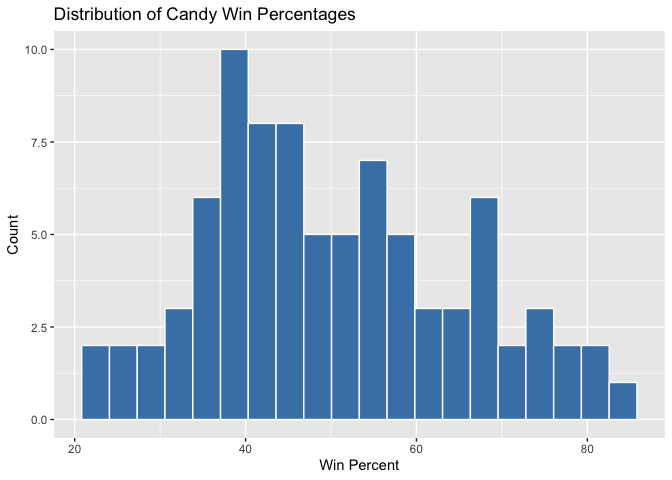
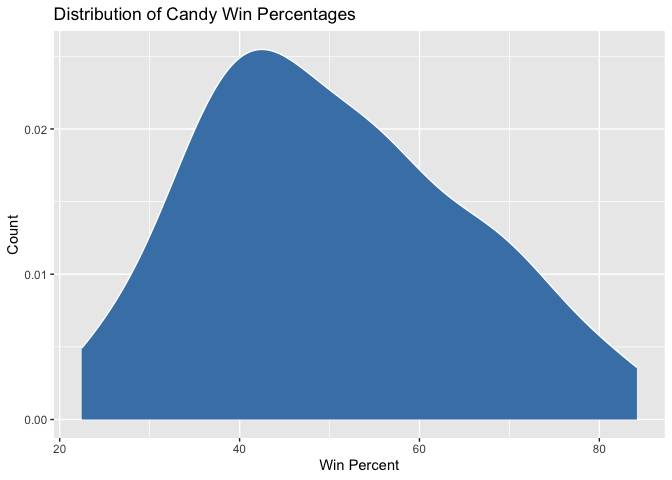
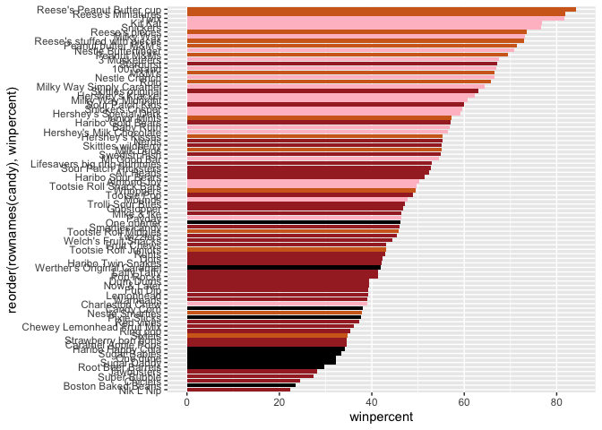
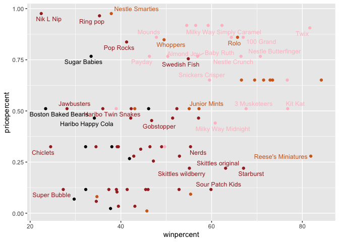
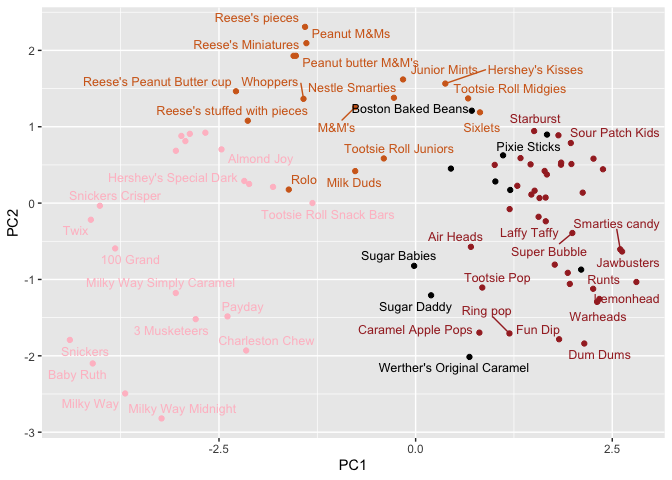
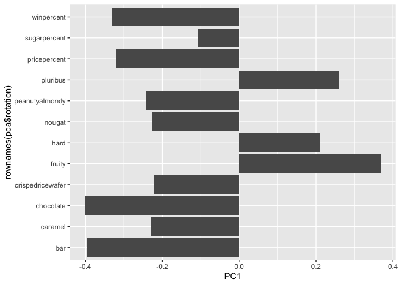

# Class 10
Yuntian Zhu (PID: A17816597)

- [Data Import](#data-import)
- [Quick overview of the dataset](#quick-overview-of-the-dataset)
- [Winpercent and Pricepercent](#winpercent-and-pricepercent)
- [Exploring the correlation
  structure](#exploring-the-correlation-structure)
- [Principal Component Analysis](#principal-component-analysis)

Today we will do a mini project about Halloween

Our data come from the 538 website and is available as a CSV file

## Data Import

``` r
candy <- read.csv("candy-data.csv", row.names = "competitorname")

head(candy)
```

                 chocolate fruity caramel peanutyalmondy nougat crispedricewafer
    100 Grand            1      0       1              0      0                1
    3 Musketeers         1      0       0              0      1                0
    One dime             0      0       0              0      0                0
    One quarter          0      0       0              0      0                0
    Air Heads            0      1       0              0      0                0
    Almond Joy           1      0       0              1      0                0
                 hard bar pluribus sugarpercent pricepercent winpercent
    100 Grand       0   1        0        0.732        0.860   66.97173
    3 Musketeers    0   1        0        0.604        0.511   67.60294
    One dime        0   0        0        0.011        0.116   32.26109
    One quarter     0   0        0        0.011        0.511   46.11650
    Air Heads       0   0        0        0.906        0.511   52.34146
    Almond Joy      0   1        0        0.465        0.767   50.34755

``` r
flextable::flextable(head(candy, 10))
```


> Q1. How many different candy types are in this dataset?

``` r
nrow(candy)
```

    [1] 85

There are 85 types of candies in this dataset.

> Q2. How many fruity candy types are in the dataset?

``` r
sum(candy$fruity)
```

    [1] 38

There are 38 fruity candy types in the dataset.

> Q3 What is your favorite candy in the dataset and what is it’s
> winpercent value?

My favorite candy in the dataset is Almond Joy

``` r
candy["Almond Joy", "winpercent"]
```

    [1] 50.34755

Almond Joy’s winpercent is 50.35%.

> Q4. What is the winpercent value for “Kit Kat”?

``` r
candy["Kit Kat", "winpercent"]
```

    [1] 76.7686

Kitt Kat’s winpercent is 76.77%

> Q5. What is the winpercent value for “Tootsie Roll Snack Bars”?

``` r
candy["Tootsie Roll Snack Bars", "winpercent"]
```

    [1] 49.6535

Tootsie Roll Snack Bars’s winpercent is 49.65%

## Quick overview of the dataset

``` r
library (skimr)

skim(candy)
```

|                                                  |       |
|:-------------------------------------------------|:------|
| Name                                             | candy |
| Number of rows                                   | 85    |
| Number of columns                                | 12    |
| \_\_\_\_\_\_\_\_\_\_\_\_\_\_\_\_\_\_\_\_\_\_\_   |       |
| Column type frequency:                           |       |
| numeric                                          | 12    |
| \_\_\_\_\_\_\_\_\_\_\_\_\_\_\_\_\_\_\_\_\_\_\_\_ |       |
| Group variables                                  | None  |

Data summary

**Variable type: numeric**

| skim_variable | n_missing | complete_rate | mean | sd | p0 | p25 | p50 | p75 | p100 | hist |
|:---|---:|---:|---:|---:|---:|---:|---:|---:|---:|:---|
| chocolate | 0 | 1 | 0.44 | 0.50 | 0.00 | 0.00 | 0.00 | 1.00 | 1.00 | ▇▁▁▁▆ |
| fruity | 0 | 1 | 0.45 | 0.50 | 0.00 | 0.00 | 0.00 | 1.00 | 1.00 | ▇▁▁▁▆ |
| caramel | 0 | 1 | 0.16 | 0.37 | 0.00 | 0.00 | 0.00 | 0.00 | 1.00 | ▇▁▁▁▂ |
| peanutyalmondy | 0 | 1 | 0.16 | 0.37 | 0.00 | 0.00 | 0.00 | 0.00 | 1.00 | ▇▁▁▁▂ |
| nougat | 0 | 1 | 0.08 | 0.28 | 0.00 | 0.00 | 0.00 | 0.00 | 1.00 | ▇▁▁▁▁ |
| crispedricewafer | 0 | 1 | 0.08 | 0.28 | 0.00 | 0.00 | 0.00 | 0.00 | 1.00 | ▇▁▁▁▁ |
| hard | 0 | 1 | 0.18 | 0.38 | 0.00 | 0.00 | 0.00 | 0.00 | 1.00 | ▇▁▁▁▂ |
| bar | 0 | 1 | 0.25 | 0.43 | 0.00 | 0.00 | 0.00 | 0.00 | 1.00 | ▇▁▁▁▂ |
| pluribus | 0 | 1 | 0.52 | 0.50 | 0.00 | 0.00 | 1.00 | 1.00 | 1.00 | ▇▁▁▁▇ |
| sugarpercent | 0 | 1 | 0.48 | 0.28 | 0.01 | 0.22 | 0.47 | 0.73 | 0.99 | ▇▇▇▇▆ |
| pricepercent | 0 | 1 | 0.47 | 0.29 | 0.01 | 0.26 | 0.47 | 0.65 | 0.98 | ▇▇▇▇▆ |
| winpercent | 0 | 1 | 50.32 | 14.71 | 22.45 | 39.14 | 47.83 | 59.86 | 84.18 | ▃▇▆▅▂ |

> Q6. Is there any variable/column that looks to be on a different scale
> to the majority of the other columns in the dataset?

The winpercent column has a very different scale, compared to the
majority of the other columns.

> Q7. What do you think a zero and one represent for the
> candy\$chocolate column?

The zero means that candy does not contain chocolate. The one mean that
the candy contain chocolate.

> Q8. Plot a histogram of winpercent values

``` r
library(ggplot2)

# Plot histogram
ggplot(candy, aes(x = winpercent)) +
  geom_histogram(bins = 20, fill = "steelblue", color = "white") +
  labs(
    title = "Distribution of Candy Win Percentages",
    x = "Win Percent",
    y = "Count"
  ) 
```



> Q9. Is the distribution of winpercent values symmetrical?

``` r
library(ggplot2)

# Plot histogram
ggplot(candy, aes(x = winpercent)) +
  geom_density(bins = 20, fill = "steelblue", color = "white") +
  labs(
    title = "Distribution of Candy Win Percentages",
    x = "Win Percent",
    y = "Count"
  ) 
```

    Warning in geom_density(bins = 20, fill = "steelblue", color = "white"):
    Ignoring unknown parameters: `bins`



The distribution of winpercent is not symmetrical. Instead, it is skewed
to the right in terms of statistical terminology.

> Q10. Is the center of the distribution above or below 50%?

``` r
mean(candy$winpercent)
```

    [1] 50.31676

``` r
summary(candy$winpercent)
```

       Min. 1st Qu.  Median    Mean 3rd Qu.    Max. 
      22.45   39.14   47.83   50.32   59.86   84.18 

If we use the mean as the measure of the center, it is indeed above 50%.

However, since the data is asymmetrical, median is a better measure of
the center, and it is below 50%.

> Q11. On average is chocolate candy higher or lower ranked than fruity
> candy?

``` r
# 1. Find all chocolate candy 
# 2. Find their winpercent values
# 3. Calculate the mean of these values
# 4-6 Do the same for fruity candy
# 7. Compare mean winpercents of chocolate vs fruity
# 8. Pick the highest as the winner

choc.inds <- candy$chocolate == 1
choc.win <- candy[choc.inds, ]$winpercent
choc.mean <- mean(choc.win)
choc.mean
```

    [1] 60.92153

``` r
fruity.inds <- candy$fruity == 1
fruity.win <- candy[fruity.inds, ]$winpercent
fruity.mean <- mean(fruity.win)
fruity.mean
```

    [1] 44.11974

On average, chocolate candies are ranked higher than fruity candy.

> Q12. Is this difference statistically significant?

``` r
t.test(choc.win, fruity.win)
```


        Welch Two Sample t-test

    data:  choc.win and fruity.win
    t = 6.2582, df = 68.882, p-value = 2.871e-08
    alternative hypothesis: true difference in means is not equal to 0
    95 percent confidence interval:
     11.44563 22.15795
    sample estimates:
    mean of x mean of y 
     60.92153  44.11974 

The t-test results in a p value that is extremely small (2.871e-8),
which is significantly below the commonly used cutoff (5%). Therefore,
the difference is statistically significant.

> Q13. What are the five least liked candy types in this set?

``` r
library(tidyverse)
```

    ── Attaching core tidyverse packages ──────────────────────── tidyverse 2.0.0 ──
    ✔ dplyr     1.1.4     ✔ readr     2.1.5
    ✔ forcats   1.0.1     ✔ stringr   1.6.0
    ✔ lubridate 1.9.4     ✔ tibble    3.3.0
    ✔ purrr     1.2.0     ✔ tidyr     1.3.1
    ── Conflicts ────────────────────────────────────────── tidyverse_conflicts() ──
    ✖ dplyr::filter() masks stats::filter()
    ✖ dplyr::lag()    masks stats::lag()
    ℹ Use the conflicted package (<http://conflicted.r-lib.org/>) to force all conflicts to become errors

``` r
library(tibble)

candy %>%
  rownames_to_column("competitorname") %>%   # restore candy names as a column
  arrange(winpercent) %>%                    # sort by winpercent ascending
  select(competitorname, winpercent) %>%     # select only these columns
  head(5)                                    # show 5 least liked candies
```

          competitorname winpercent
    1          Nik L Nip   22.44534
    2 Boston Baked Beans   23.41782
    3           Chiclets   24.52499
    4       Super Bubble   27.30386
    5         Jawbusters   28.12744

The five least liked candy types are Nik L Nip, Boston Baked Beans,
Chiclets, Super Bubble and Jawbusters.

> Q14. What are the top 5 all time favorite candy types out of this set?

``` r
candy %>%
  rownames_to_column("competitorname") %>%   # restore candy names as a column
  arrange(winpercent) %>%                    # sort by winpercent ascending
  select(competitorname, winpercent) %>%     # select only these columns
  tail(5)                                    # show 5 most liked candies
```

                  competitorname winpercent
    81                  Snickers   76.67378
    82                   Kit Kat   76.76860
    83                      Twix   81.64291
    84        Reese's Miniatures   81.86626
    85 Reese's Peanut Butter cup   84.18029

The five most liked candy types are Snickers, Kit Kat, Twix, Reese’s
Miniatures and Reese’s Peanut Butter Cup.

> Q15. Make a first barplot of candy ranking based on winpercent values

``` r
ggplot(candy) + 
  aes(winpercent, rownames(candy)) +
  geom_col()
```


> Q16. This is quite ugly, use the reorder() function to get the bars
> sorted by winpercent?

``` r
ggplot(candy) + 
  aes(winpercent, reorder(rownames(candy), winpercent)) +
  geom_col()
```


Add some color based on the “type of candy”

``` r
my_cols <- rep("black", nrow(candy))
my_cols[as.logical((candy$chocolate))] <- "chocolate"
my_cols[as.logical((candy$fruity))] <- "brown"
my_cols[as.logical((candy$bar))] <- "pink"
```

``` r
ggplot(candy) + 
  aes(winpercent, reorder(rownames(candy), winpercent)) +
  geom_col(fill = my_cols)
```



> Q17. What is the worst ranked chocolate candy?

The worst ranked chocolate candy is Sixlets.

> Q18. What is the best ranked fruity candy?

The best ranked fruity candy is Starburst.

## Winpercent and Pricepercent

A plot wit both variables/columns winpercent and pricepercent

``` r
library(ggrepel)
ggplot(candy) +
  aes(winpercent, pricepercent, label=rownames(candy)) +
  geom_point(col=my_cols) + 
  geom_text_repel(col=my_cols, size=3.3, max.overlaps = 5)
```

    Warning: ggrepel: 50 unlabeled data points (too many overlaps). Consider
    increasing max.overlaps



> Q19. Which candy type is the highest ranked in terms of winpercent for
> the least money - i.e. offers the most bang for your buck?

We can answer this question by calculating the ratio between winpercent
and pricepercent.

``` r
candy %>%
  mutate(
    bang_for_buck = winpercent / pricepercent,  
    name = rownames(.)                         
  ) %>%
  arrange(desc(bang_for_buck)) %>%             
  slice(1)                        
```

                         chocolate fruity caramel peanutyalmondy nougat
    Tootsie Roll Midgies         1      0       0              0      0
                         crispedricewafer hard bar pluribus sugarpercent
    Tootsie Roll Midgies                0    0   0        1        0.174
                         pricepercent winpercent bang_for_buck                 name
    Tootsie Roll Midgies        0.011   45.73675      4157.886 Tootsie Roll Midgies

Therefore, the candy type is Tootsie Roll Midgies.

> Q20. What are the top 5 most expensive candy types in the dataset and
> of these which is the least popular?

``` r
candy %>%
  arrange(desc(pricepercent)) %>%            
  head(5) %>%                               
  mutate(name = rownames(.)) %>%             
  arrange(winpercent)                               
```

                             chocolate fruity caramel peanutyalmondy nougat
    Nik L Nip                        0      1       0              0      0
    Ring pop                         0      1       0              0      0
    Nestle Smarties                  1      0       0              0      0
    Hershey's Milk Chocolate         1      0       0              0      0
    Hershey's Krackel                1      0       0              0      0
                             crispedricewafer hard bar pluribus sugarpercent
    Nik L Nip                               0    0   0        1        0.197
    Ring pop                                0    1   0        0        0.732
    Nestle Smarties                         0    0   0        1        0.267
    Hershey's Milk Chocolate                0    0   1        0        0.430
    Hershey's Krackel                       1    0   1        0        0.430
                             pricepercent winpercent                     name
    Nik L Nip                       0.976   22.44534                Nik L Nip
    Ring pop                        0.965   35.29076                 Ring pop
    Nestle Smarties                 0.976   37.88719          Nestle Smarties
    Hershey's Milk Chocolate        0.918   56.49050 Hershey's Milk Chocolate
    Hershey's Krackel               0.918   62.28448        Hershey's Krackel

The 5 most expensive candy types are Nik L Nip, Ring pop, Nestle
Smarties, Hershey’s Milk Chocolate and Hershey’s Krackel. The least
popular one is Nik L Nip.

## Exploring the correlation structure

Now that we’ve explored the dataset a little, we’ll see how the
variables interact with one another. We’ll use correlation and view the
results with the corrplot package to plot a correlation matrix.

``` r
library(corrplot)
```

    corrplot 0.95 loaded

``` r
cij <- cor(candy)
corrplot(cij)
```


> Q22. Examining this plot what two variables are anti-correlated
> (i.e. have minus values)?

Fruity and chocolate are the two most anti-correlated variables.

> Q23. Similarly, what two variables are most positively correlated?

Each candy type is positively correlated with itself (coefficient = 1).
Chocolate is highly correlated with bar and winpercent.

## Principal Component Analysis

The function to use is called `prcomp()`. It has an optional scale
argument.

``` r
pca <- prcomp(candy, scale = TRUE)
summary(pca)
```

    Importance of components:
                              PC1    PC2    PC3     PC4    PC5     PC6     PC7
    Standard deviation     2.0788 1.1378 1.1092 1.07533 0.9518 0.81923 0.81530
    Proportion of Variance 0.3601 0.1079 0.1025 0.09636 0.0755 0.05593 0.05539
    Cumulative Proportion  0.3601 0.4680 0.5705 0.66688 0.7424 0.79830 0.85369
                               PC8     PC9    PC10    PC11    PC12
    Standard deviation     0.74530 0.67824 0.62349 0.43974 0.39760
    Proportion of Variance 0.04629 0.03833 0.03239 0.01611 0.01317
    Cumulative Proportion  0.89998 0.93832 0.97071 0.98683 1.00000

Our main PCA result figure

``` r
ggplot(pca$x)+
  aes(PC1, PC2, label = rownames(pca$x)) +
  geom_point(col = my_cols) +
  geom_text_repel(size=3.3, col=my_cols, max.overlaps = 7)
```

    Warning: ggrepel: 35 unlabeled data points (too many overlaps). Consider
    increasing max.overlaps



We should also examine the variable “loadings” or contributions of the
original variables to the new PCs

``` r
ggplot(pca$rotation) +
  aes(PC1, rownames(pca$rotation)) +
  geom_col()
```



Interactive plots that can be zoomed on and “brushed” over can be made
with the **plotly** package. But this does not work in PDF.

> Q24. What original variables are picked up strongly by PC1 in the
> positive direction? Do these make sense to you?

Fruity, hard and pluribus. This makes sense to me because all the brown
points (the color of fruity) are on the right part of the pca plot.
