# Class11
Yuntian Zhu (PID: A17816597)

- [AlphaFold Data Base (AFDB)](#alphafold-data-base-afdb)
- [Generating your own structure
  predictions](#generating-your-own-structure-predictions)
- [Custom analysis of resulting models in
  R](#custom-analysis-of-resulting-models-in-r)
- [Predicted Alignment Error for
  domains](#predicted-alignment-error-for-domains)
- [Residue conservation from alignment
  file](#residue-conservation-from-alignment-file)

## AlphaFold Data Base (AFDB)

The EBI maintains the largest database of AlphaFold structure prediction
models at: https://alphafold.ebi.ac.uk/

FOr last class, we saw that the PDB had 244290 structures (October
2025).

The total number of protein sequences in Uniprot is 199579901.

``` r
(244290/199579901)*100
```

    [1] 0.1224021

Only about 0.1% proteins on Uniprot have structures. This is a really
tiny fraction.

AFDB is attempting to address this gap.

There are two “Quality Scores” for AlphaFold. One is fro residues
(i.e. each amino acid) called pLDDT. The other PAE score measures the
confidence in the relative position of two residue (i.e. each amino acid
pair).

## Generating your own structure predictions

Below is the superimpose by chian of the five predicted structures by
AlphaFold.

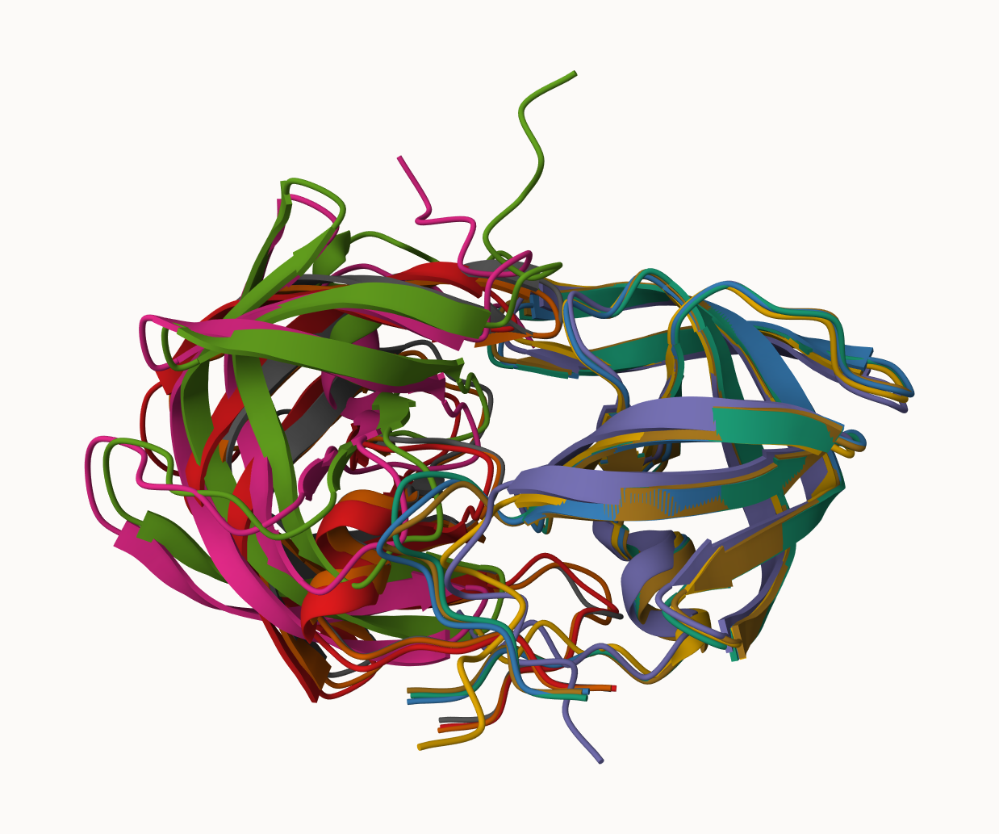

Below is the structure of the top structure predicted by AlphaFold.

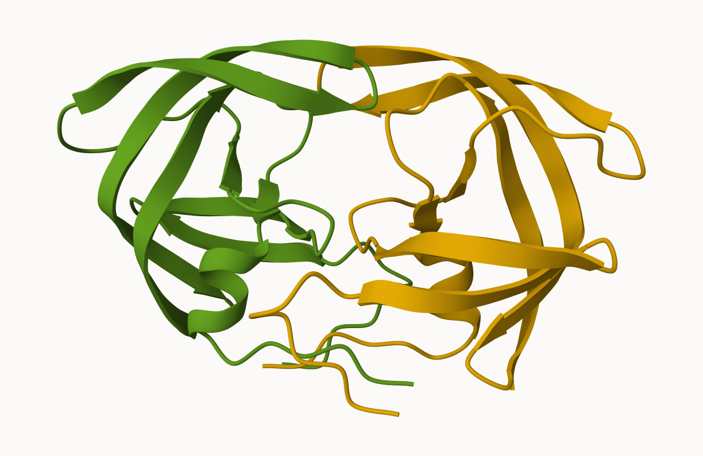

Below is picture of pLDDT scores shown by colors for the top ranked
model

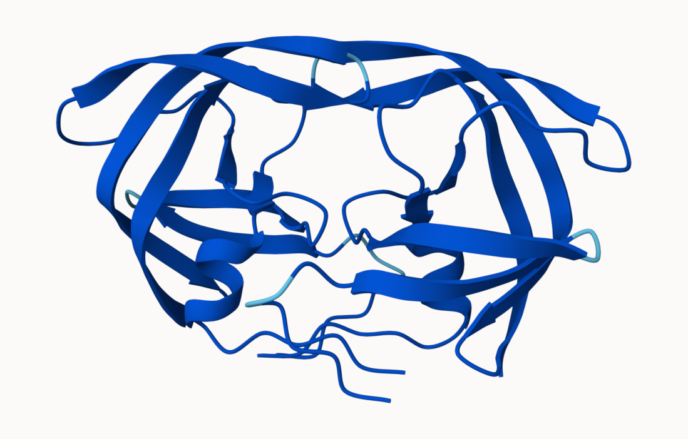

Below is picture of pLDDT scores shown by colors for the model 5

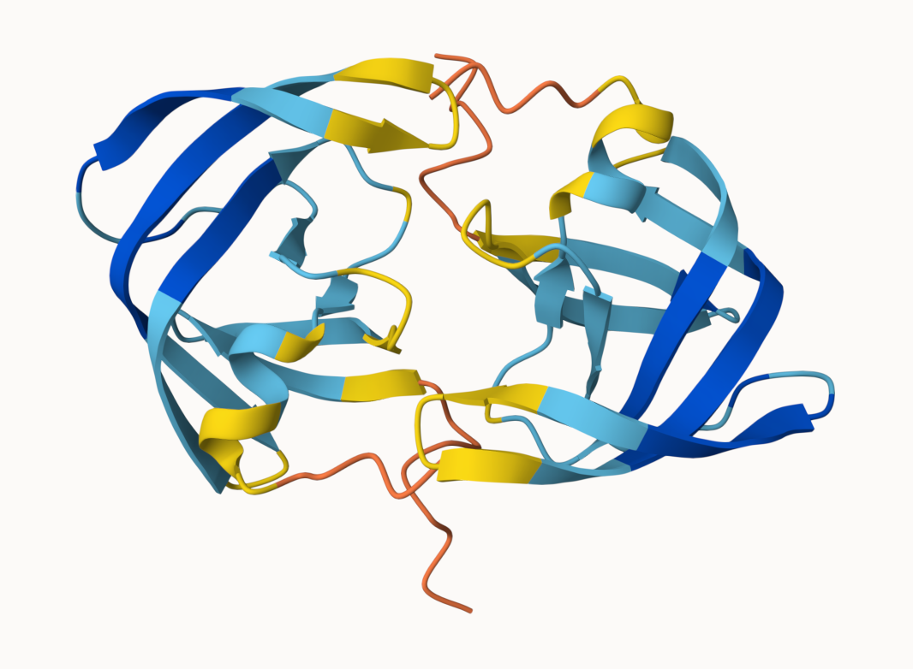 We can see that the rank1 model has a significantly
higher confidence than the rank5 model.

## Custom analysis of resulting models in R

Read key result files into R. The first thing that I need to know is
what my results directory is called.

``` r
# Change this for YOUR results dir name
results_dir <- "HIVPrDimer_23119_2/"
# File names for all PDB models
pdb_files <- list.files(path=results_dir,
                        pattern="*.pdb",
                        full.names = TRUE)

# Print our PDB file names
basename(pdb_files)
```

    [1] "Rank1.pdb" "Rank2.pdb" "Rank3.pdb" "Rank4.pdb" "Rank5.pdb"

``` r
library(bio3d)

# Read all data from Models 
#  and superpose/fit coords
pdbs <- pdbaln(pdb_files, fit=TRUE, exefile="msa")
```

    Reading PDB files:
    HIVPrDimer_23119_2//Rank1.pdb
    HIVPrDimer_23119_2//Rank2.pdb
    HIVPrDimer_23119_2//Rank3.pdb
    HIVPrDimer_23119_2//Rank4.pdb
    HIVPrDimer_23119_2//Rank5.pdb
    .....

    Extracting sequences

    pdb/seq: 1   name: HIVPrDimer_23119_2//Rank1.pdb 
    pdb/seq: 2   name: HIVPrDimer_23119_2//Rank2.pdb 
    pdb/seq: 3   name: HIVPrDimer_23119_2//Rank3.pdb 
    pdb/seq: 4   name: HIVPrDimer_23119_2//Rank4.pdb 
    pdb/seq: 5   name: HIVPrDimer_23119_2//Rank5.pdb 

``` r
pdbs
```

                                  1        .         .         .         .         50 
    [Truncated_Name:1]Rank1.pdb   PQITLWQRPLVTIKIGGQLKEALLDTGADDTVLEEMSLPGRWKPKMIGGI
    [Truncated_Name:2]Rank2.pdb   PQITLWQRPLVTIKIGGQLKEALLDTGADDTVLEEMSLPGRWKPKMIGGI
    [Truncated_Name:3]Rank3.pdb   PQITLWQRPLVTIKIGGQLKEALLDTGADDTVLEEMSLPGRWKPKMIGGI
    [Truncated_Name:4]Rank4.pdb   PQITLWQRPLVTIKIGGQLKEALLDTGADDTVLEEMSLPGRWKPKMIGGI
    [Truncated_Name:5]Rank5.pdb   PQITLWQRPLVTIKIGGQLKEALLDTGADDTVLEEMSLPGRWKPKMIGGI
                                  ************************************************** 
                                  1        .         .         .         .         50 

                                 51        .         .         .         .         100 
    [Truncated_Name:1]Rank1.pdb   GGFIKVRQYDQILIEICGHKAIGTVLVGPTPVNIIGRNLLTQIGCTLNFP
    [Truncated_Name:2]Rank2.pdb   GGFIKVRQYDQILIEICGHKAIGTVLVGPTPVNIIGRNLLTQIGCTLNFP
    [Truncated_Name:3]Rank3.pdb   GGFIKVRQYDQILIEICGHKAIGTVLVGPTPVNIIGRNLLTQIGCTLNFP
    [Truncated_Name:4]Rank4.pdb   GGFIKVRQYDQILIEICGHKAIGTVLVGPTPVNIIGRNLLTQIGCTLNFP
    [Truncated_Name:5]Rank5.pdb   GGFIKVRQYDQILIEICGHKAIGTVLVGPTPVNIIGRNLLTQIGCTLNFP
                                  ************************************************** 
                                 51        .         .         .         .         100 

                                101        .         .         .         .         150 
    [Truncated_Name:1]Rank1.pdb   QITLWQRPLVTIKIGGQLKEALLDTGADDTVLEEMSLPGRWKPKMIGGIG
    [Truncated_Name:2]Rank2.pdb   QITLWQRPLVTIKIGGQLKEALLDTGADDTVLEEMSLPGRWKPKMIGGIG
    [Truncated_Name:3]Rank3.pdb   QITLWQRPLVTIKIGGQLKEALLDTGADDTVLEEMSLPGRWKPKMIGGIG
    [Truncated_Name:4]Rank4.pdb   QITLWQRPLVTIKIGGQLKEALLDTGADDTVLEEMSLPGRWKPKMIGGIG
    [Truncated_Name:5]Rank5.pdb   QITLWQRPLVTIKIGGQLKEALLDTGADDTVLEEMSLPGRWKPKMIGGIG
                                  ************************************************** 
                                101        .         .         .         .         150 

                                151        .         .         .         .       198 
    [Truncated_Name:1]Rank1.pdb   GFIKVRQYDQILIEICGHKAIGTVLVGPTPVNIIGRNLLTQIGCTLNF
    [Truncated_Name:2]Rank2.pdb   GFIKVRQYDQILIEICGHKAIGTVLVGPTPVNIIGRNLLTQIGCTLNF
    [Truncated_Name:3]Rank3.pdb   GFIKVRQYDQILIEICGHKAIGTVLVGPTPVNIIGRNLLTQIGCTLNF
    [Truncated_Name:4]Rank4.pdb   GFIKVRQYDQILIEICGHKAIGTVLVGPTPVNIIGRNLLTQIGCTLNF
    [Truncated_Name:5]Rank5.pdb   GFIKVRQYDQILIEICGHKAIGTVLVGPTPVNIIGRNLLTQIGCTLNF
                                  ************************************************ 
                                151        .         .         .         .       198 

    Call:
      pdbaln(files = pdb_files, fit = TRUE, exefile = "msa")

    Class:
      pdbs, fasta

    Alignment dimensions:
      5 sequence rows; 198 position columns (198 non-gap, 0 gap) 

    + attr: xyz, resno, b, chain, id, ali, resid, sse, call

The alignment makes sense here, since all the five pdb files have the
same sequences.

RMSD is a standard measure of structural distance between coordinate
sets. We can use the `rmsd()` function to calculate the RMSD between all
pairs models.

``` r
rd <- rmsd(pdbs, fit=T)
```

    Warning in rmsd(pdbs, fit = T): No indices provided, using the 198 non NA positions

``` r
range(rd)
```

    [1]  0.000 14.754

Draw a heatmap of these RMSD matrix values

``` r
library(pheatmap)

colnames(rd) <- paste0("Rank", 1:5)
rownames(rd) <- paste0("Rank", 1:5)
pheatmap(rd)
```

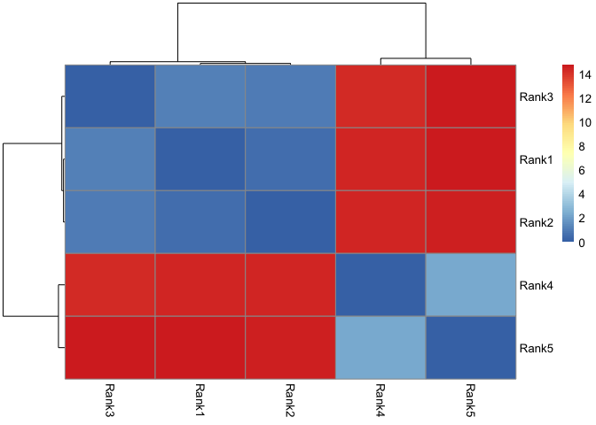

From the heatmap, we can find that the models that are ranked 1st, 2nd
and 3rd are quite similar to each other. On the other hand, the two last
ranked models are very similar to each other.

Now lets plot the pLDDT values across all models. Recall that this
information is in the B-factor column of each model and that this is
stored in our aligned pdbs object as pdbs\$b with a row per
structure/model.

``` r
plotb3(pdbs$b[1,], typ="l", lwd=2, sse=pdbs)
```

    Warning in plotb3(pdbs$b[1, ], typ = "l", lwd = 2, sse = pdbs): Length of input
    'sse' does not equal the length of input 'x'; Ignoring 'sse'

``` r
points(pdbs$b[2,], typ="l", col="red")
points(pdbs$b[3,], typ="l", col="blue")
points(pdbs$b[4,], typ="l", col="darkgreen")
points(pdbs$b[5,], typ="l", col="orange")
abline(v=100, col="gray")
```

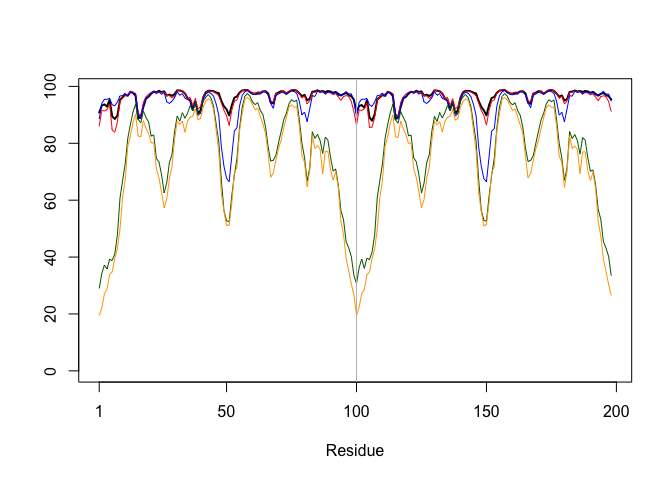

Notably, 3 of the 5 models have high pLDDT confidence throughout the
residues, while the other two models have certain regions where pLDDT
values are low.

We can improve the superposition/fitting of our models by finding the
most consistent “rigid core” common across all the models.

``` r
core <- core.find(pdbs)
```

     core size 197 of 198  vol = 9836.196 
     core size 196 of 198  vol = 6800.793 
     core size 195 of 198  vol = 1322.091 
     core size 194 of 198  vol = 1032.249 
     core size 193 of 198  vol = 944.133 
     core size 192 of 198  vol = 894.048 
     core size 191 of 198  vol = 829.724 
     core size 190 of 198  vol = 766.628 
     core size 189 of 198  vol = 728.681 
     core size 188 of 198  vol = 693.317 
     core size 187 of 198  vol = 656.166 
     core size 186 of 198  vol = 622.063 
     core size 185 of 198  vol = 586.601 
     core size 184 of 198  vol = 565.358 
     core size 183 of 198  vol = 532.747 
     core size 182 of 198  vol = 511.421 
     core size 181 of 198  vol = 489.077 
     core size 180 of 198  vol = 468.599 
     core size 179 of 198  vol = 449.222 
     core size 178 of 198  vol = 433.122 
     core size 177 of 198  vol = 418.651 
     core size 176 of 198  vol = 405.069 
     core size 175 of 198  vol = 391.855 
     core size 174 of 198  vol = 381.006 
     core size 173 of 198  vol = 371.54 
     core size 172 of 198  vol = 355.539 
     core size 171 of 198  vol = 345.156 
     core size 170 of 198  vol = 335.982 
     core size 169 of 198  vol = 325.275 
     core size 168 of 198  vol = 313.603 
     core size 167 of 198  vol = 302.908 
     core size 166 of 198  vol = 293.343 
     core size 165 of 198  vol = 284.547 
     core size 164 of 198  vol = 277.932 
     core size 163 of 198  vol = 269.592 
     core size 162 of 198  vol = 258.167 
     core size 161 of 198  vol = 246.856 
     core size 160 of 198  vol = 239.073 
     core size 159 of 198  vol = 234.174 
     core size 158 of 198  vol = 226.309 
     core size 157 of 198  vol = 221.212 
     core size 156 of 198  vol = 214.951 
     core size 155 of 198  vol = 206.027 
     core size 154 of 198  vol = 197.301 
     core size 153 of 198  vol = 190.889 
     core size 152 of 198  vol = 185.403 
     core size 151 of 198  vol = 179.154 
     core size 150 of 198  vol = 174.709 
     core size 149 of 198  vol = 167.269 
     core size 148 of 198  vol = 160.866 
     core size 147 of 198  vol = 156.173 
     core size 146 of 198  vol = 148.395 
     core size 145 of 198  vol = 143.389 
     core size 144 of 198  vol = 138.428 
     core size 143 of 198  vol = 132.99 
     core size 142 of 198  vol = 126.924 
     core size 141 of 198  vol = 121.257 
     core size 140 of 198  vol = 116.407 
     core size 139 of 198  vol = 112.241 
     core size 138 of 198  vol = 107.813 
     core size 137 of 198  vol = 104.807 
     core size 136 of 198  vol = 100.968 
     core size 135 of 198  vol = 97.21 
     core size 134 of 198  vol = 92.54 
     core size 133 of 198  vol = 87.964 
     core size 132 of 198  vol = 85.621 
     core size 131 of 198  vol = 81.514 
     core size 130 of 198  vol = 77.627 
     core size 129 of 198  vol = 74.881 
     core size 128 of 198  vol = 72.642 
     core size 127 of 198  vol = 70.352 
     core size 126 of 198  vol = 68.627 
     core size 125 of 198  vol = 66.349 
     core size 124 of 198  vol = 64.019 
     core size 123 of 198  vol = 61.763 
     core size 122 of 198  vol = 58.758 
     core size 121 of 198  vol = 56.354 
     core size 120 of 198  vol = 54.129 
     core size 119 of 198  vol = 51.611 
     core size 118 of 198  vol = 49.502 
     core size 117 of 198  vol = 48.045 
     core size 116 of 198  vol = 46.489 
     core size 115 of 198  vol = 44.599 
     core size 114 of 198  vol = 43.185 
     core size 113 of 198  vol = 40.978 
     core size 112 of 198  vol = 39.029 
     core size 111 of 198  vol = 36.363 
     core size 110 of 198  vol = 33.953 
     core size 109 of 198  vol = 31.343 
     core size 108 of 198  vol = 29.304 
     core size 107 of 198  vol = 27.188 
     core size 106 of 198  vol = 25.655 
     core size 105 of 198  vol = 24.03 
     core size 104 of 198  vol = 22.504 
     core size 103 of 198  vol = 20.906 
     core size 102 of 198  vol = 19.803 
     core size 101 of 198  vol = 18.215 
     core size 100 of 198  vol = 15.652 
     core size 99 of 198  vol = 14.762 
     core size 98 of 198  vol = 11.574 
     core size 97 of 198  vol = 9.391 
     core size 96 of 198  vol = 7.327 
     core size 95 of 198  vol = 6.123 
     core size 94 of 198  vol = 5.592 
     core size 93 of 198  vol = 4.689 
     core size 92 of 198  vol = 3.66 
     core size 91 of 198  vol = 2.779 
     core size 90 of 198  vol = 2.147 
     core size 89 of 198  vol = 1.725 
     core size 88 of 198  vol = 1.158 
     core size 87 of 198  vol = 0.88 
     core size 86 of 198  vol = 0.682 
     core size 85 of 198  vol = 0.527 
     core size 84 of 198  vol = 0.37 
     FINISHED: Min vol ( 0.5 ) reached

``` r
core.inds <- print(core, vol=0.5)
```

    # 85 positions (cumulative volume <= 0.5 Angstrom^3) 
      start end length
    1     9  49     41
    2    52  95     44

``` r
xyz <- pdbfit(pdbs, core.inds, outpath="corefit_structures")
```

Below is the picture of the updated superipose

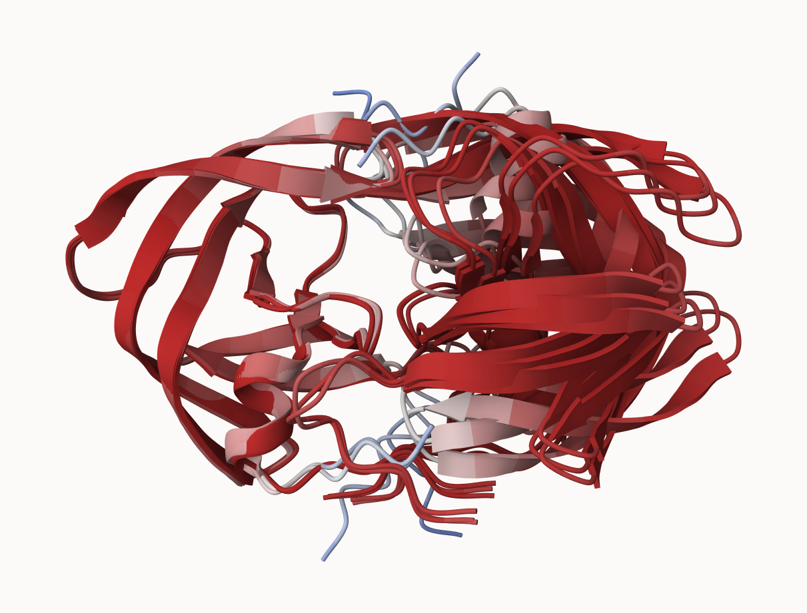

Examine the RMSF scores of these structures

``` r
rf <- rmsf(xyz)

plotb3(rf, sse=pdbs)
```

    Warning in plotb3(rf, sse = pdbs): Length of input 'sse' does not equal the
    length of input 'x'; Ignoring 'sse'

``` r
abline(v=100, col="gray", ylab="RMSF")
```

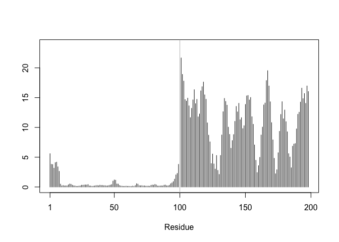

It can be clearly found that the structures of the first chain are
largely unchanged across all the 5 prediction. However, the second chain
has a very high variability.

## Predicted Alignment Error for domains

Independent of the 3D structure, AlphaFold produces an output called
Predicted Aligned Error (PAE). This is detailed in the JSON format
result files, one for each model structure.

``` r
library(jsonlite)

# Listing of all PAE JSON files
pae_files <- list.files(path=results_dir,
                        pattern=".*model.*\\.json",
                        full.names = TRUE)
```

``` r
pae1 <- read_json(pae_files[1],simplifyVector = TRUE)
pae5 <- read_json(pae_files[5],simplifyVector = TRUE)

attributes(pae1)
```

    $names
    [1] "plddt"   "max_pae" "pae"     "ptm"     "iptm"   

``` r
# Per-residue pLDDT scores 
#  same as B-factor of PDB..
head(pae1$plddt) 
```

    [1] 90.81 93.25 93.69 92.88 95.25 89.44

``` r
pae1$max_pae
```

    [1] 12.84375

``` r
pae5$max_pae
```

    [1] 29.59375

We can see that model 1 has a PAE value of around 12.84, while that of
model 5 is around 29.59. Therefore, this further confirms that model 1
is a better model.

We can plot the N by N (where N is the number of residues) PAE scores
with ggplot or with functions from the Bio3D package:

``` r
plot.dmat(pae1$pae, 
          xlab="Residue Position (i)",
          ylab="Residue Position (j)")
```

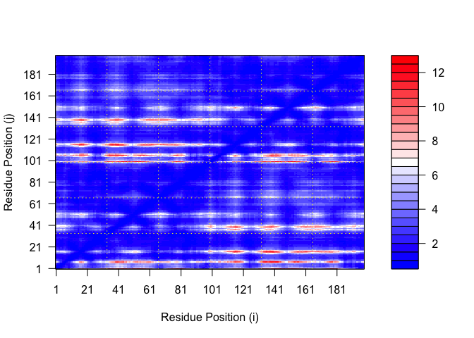

``` r
plot.dmat(pae5$pae, 
          xlab="Residue Position (i)",
          ylab="Residue Position (j)",
          grid.col = "black",
          zlim=c(0,30))
```

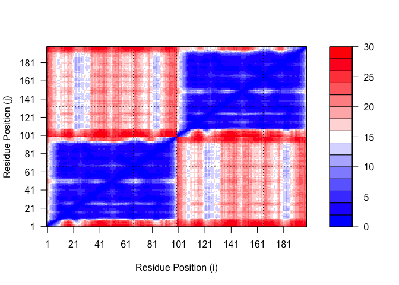

By using the same color range between model 1 and model 5, we can better
compare these two graphs.

``` r
plot.dmat(pae1$pae, 
          xlab="Residue Position (i)",
          ylab="Residue Position (j)",
          grid.col = "black",
          zlim=c(0,30))
```


One obvious conclusion here is that model 1 has significantly higher PAE
scores in a great fraction of residues, compared to model 5.

## Residue conservation from alignment file

``` r
aln_file <- list.files(path=results_dir,
                       pattern=".a3m$",
                        full.names = TRUE)
aln_file
```

    [1] "HIVPrDimer_23119_2//HIVPrDimer_23119_2.a3m"

``` r
aln <- read.fasta(aln_file[1], to.upper = TRUE)
```

    [1] " ** Duplicated sequence id's: 101 **"
    [2] " ** Duplicated sequence id's: 101 **"

We can find how many sequences are in the alignment by using the dim()
function.

``` r
dim(aln$ali)
```

    [1] 5397  132

We can score residue conservation in the alignment with the `conserv()`
function.

``` r
sim <- conserv(aln)
plotb3(sim[1:99], sse=trim.pdbs(pdbs, chain="A"),
       ylab="Conservation Score")
```

    Warning in plotb3(sim[1:99], sse = trim.pdbs(pdbs, chain = "A"), ylab =
    "Conservation Score"): Length of input 'sse' does not equal the length of input
    'x'; Ignoring 'sse'

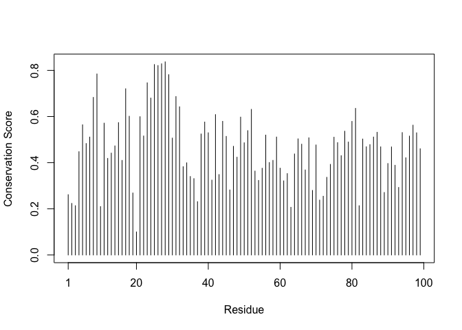

Note the conserved Active Site residues D25, T26, G27, A28. These
positions will stand out if we generate a consensus sequence with a high
cutoff value:

``` r
con <- consensus(aln, cutoff = 0.9)
con$seq
```

      [1] "-" "-" "-" "-" "-" "-" "-" "-" "-" "-" "-" "-" "-" "-" "-" "-" "-" "-"
     [19] "-" "-" "-" "-" "-" "-" "D" "T" "G" "A" "-" "-" "-" "-" "-" "-" "-" "-"
     [37] "-" "-" "-" "-" "-" "-" "-" "-" "-" "-" "-" "-" "-" "-" "-" "-" "-" "-"
     [55] "-" "-" "-" "-" "-" "-" "-" "-" "-" "-" "-" "-" "-" "-" "-" "-" "-" "-"
     [73] "-" "-" "-" "-" "-" "-" "-" "-" "-" "-" "-" "-" "-" "-" "-" "-" "-" "-"
     [91] "-" "-" "-" "-" "-" "-" "-" "-" "-" "-" "-" "-" "-" "-" "-" "-" "-" "-"
    [109] "-" "-" "-" "-" "-" "-" "-" "-" "-" "-" "-" "-" "-" "-" "-" "-" "-" "-"
    [127] "-" "-" "-" "-" "-" "-"

Now, it is even more notable that the active site “DTGA” is extremely
conserved throughout the alignment.

For a final visualization of these functionally important sites we can
map this conservation score to the Occupancy column of a PDB file for
viewing in molecular viewer programs such as Mol\*.

``` r
m1.pdb <- read.pdb(pdb_files[1])
occ <- vec2resno(c(sim[1:99], sim[1:99]), m1.pdb$atom$resno)
write.pdb(m1.pdb, o=occ, file="m1_conserv.pdb")
```

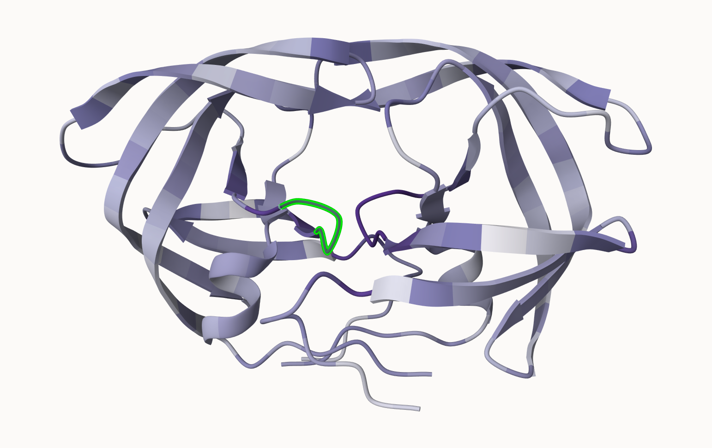

The regions with high conservation scores are in dark purple. The DTGA
site is in green.
