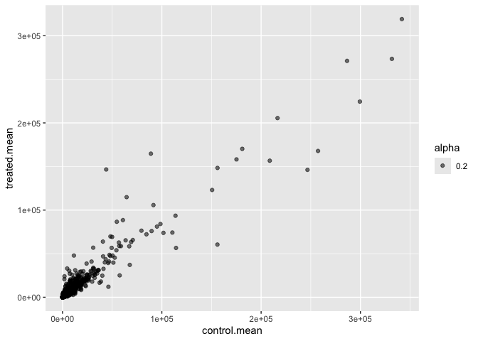
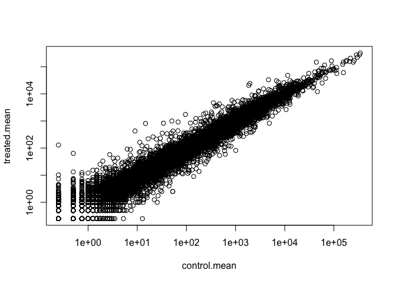
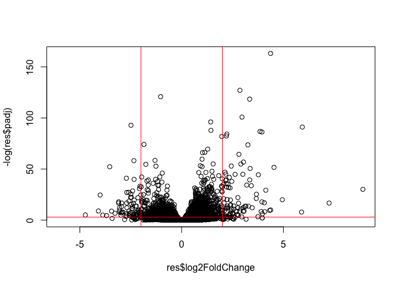
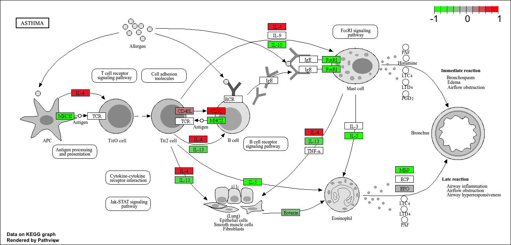

# Class12
Yuntian Zhu (PID: A17816597)

- [Backgroun](#backgroun)
- [Data import](#data-import)
- [Toy differential gene
  experession](#toy-differential-gene-experession)
- [DESeq2 analysis](#deseq2-analysis)
- [Volcano Plot](#volcano-plot)
- [Save our results](#save-our-results)
- [Add gene annotation](#add-gene-annotation)
- [Pathway analysis](#pathway-analysis)
- [Save our results](#save-our-results-1)

## Backgroun

Today we will analyze some RNA-seq data on the effects of a common
steroid on airway smooth muscle cells.

## Data import

``` r
counts <- read.csv("airway_scaledcounts.csv", row.names=1)
metadata <- read.csv("airway_metadata.csv")
head(counts)
```

                    SRR1039508 SRR1039509 SRR1039512 SRR1039513 SRR1039516
    ENSG00000000003        723        486        904        445       1170
    ENSG00000000005          0          0          0          0          0
    ENSG00000000419        467        523        616        371        582
    ENSG00000000457        347        258        364        237        318
    ENSG00000000460         96         81         73         66        118
    ENSG00000000938          0          0          1          0          2
                    SRR1039517 SRR1039520 SRR1039521
    ENSG00000000003       1097        806        604
    ENSG00000000005          0          0          0
    ENSG00000000419        781        417        509
    ENSG00000000457        447        330        324
    ENSG00000000460         94        102         74
    ENSG00000000938          0          0          0

``` r
head(metadata)
```

              id     dex celltype     geo_id
    1 SRR1039508 control   N61311 GSM1275862
    2 SRR1039509 treated   N61311 GSM1275863
    3 SRR1039512 control  N052611 GSM1275866
    4 SRR1039513 treated  N052611 GSM1275867
    5 SRR1039516 control  N080611 GSM1275870
    6 SRR1039517 treated  N080611 GSM1275871

> Q1. How many genes are in this dataset?

``` r
nrow(counts)
```

    [1] 38694

There are 38694 genes in this dataset.

> Q. How many different experiments (columns in counts or rows in
> metadata) are there?

``` r
ncol(counts)
```

    [1] 8

> Q2. How many ‘control’ cell lines do we have?

``` r
sum(metadata$dex == "control")
```

    [1] 4

We have 4 control cell lines.

## Toy differential gene experession

To start our analysis, let’s calculate the mean counts of the counts for
all genes in the “control” experiments

1.  Extract all “control columns from the `counts` object

2.  Calculate the mean for all rows (i. e. genes) of these “control”
    columns

3 and 4. Do the same thing for “treated” groups

5.  Compare these `control.mean` and `treated.mean` values.

Method 1:

``` r
control <- metadata[metadata[,"dex"]=="control",]
control.counts <- counts[ ,control$id]
control.mean <- rowSums( control.counts )/4 
head(control.mean)
```

    ENSG00000000003 ENSG00000000005 ENSG00000000419 ENSG00000000457 ENSG00000000460 
             900.75            0.00          520.50          339.75           97.25 
    ENSG00000000938 
               0.75 

> Q3. How would you make the above code in either approach more robust?
> Is there a function that could help here?

The method above finds the mean by first calculate the summation and
divide it by 4 (the number of samples), which is not very robust. The
primary reason is that there might be a different sample number and we
need to change 4 to another number by ourselves. We can improve the code
by using the function `rowMeans()`. By using `rowMeans()`, the mean is
calculated automatically across however many samples are present,
without requiring us to hard-code the sample count. This not only makes
the code more flexible and maintainable, but also reduces the risk of
errors when working with different datasets or experimental designs.

``` r
control.inds <- metadata$dex == "control"
control.count <- counts[, control.inds]
control.mean <- rowMeans(control.count)
head(control.mean)
```

    ENSG00000000003 ENSG00000000005 ENSG00000000419 ENSG00000000457 ENSG00000000460 
             900.75            0.00          520.50          339.75           97.25 
    ENSG00000000938 
               0.75 

> Q4. Follow the same procedure for the treated samples (i.e. calculate
> the mean per gene across drug treated samples and assign to a labeled
> vector called treated.mean)

``` r
treated.inds <- metadata$dex == "treated"
treated.count <- counts[, treated.inds]
treated.mean <- rowMeans(treated.count)
head(treated.mean)
```

    ENSG00000000003 ENSG00000000005 ENSG00000000419 ENSG00000000457 ENSG00000000460 
             658.00            0.00          546.00          316.50           78.75 
    ENSG00000000938 
               0.00 

Store these all together for the ease of bookkeeping as `meancounts`

``` r
meancounts <- data.frame(control.mean, treated.mean)
head(meancounts)
```

                    control.mean treated.mean
    ENSG00000000003       900.75       658.00
    ENSG00000000005         0.00         0.00
    ENSG00000000419       520.50       546.00
    ENSG00000000457       339.75       316.50
    ENSG00000000460        97.25        78.75
    ENSG00000000938         0.75         0.00

> Q5 (a). Create a scatter plot showing the mean of the treated samples
> against the mean of the control samples.

Let us make a plot of control vs. treated mean values

``` r
plot(meancounts)
```


> Q5 (b).You could also use the ggplot2 package to make this figure
> producing the plot below. What geom\_?() function would you use for
> this plot?

Let us make another plot using ggplot2. We should use `geom_point()`
here.

``` r
library(ggplot2)
  ggplot(meancounts) + 
    aes(control.mean, treated.mean, alpha = 0.2) + 
    geom_point()
```



> Q6. Try plotting both axes on a log scale. What is the argument to
> plot() that allows you to do this?

Make this a log log plot, so that the plot gets less crowded. The
argument that we should use here is `log = "xy"`.

``` r
plot(meancounts, log = "xy")
```

    Warning in xy.coords(x, y, xlabel, ylabel, log): 15032 x values <= 0 omitted
    from logarithmic plot

    Warning in xy.coords(x, y, xlabel, ylabel, log): 15281 y values <= 0 omitted
    from logarithmic plot



We oftern talk about metrics like log2FC. Let’s calculate the log2 fold
change for our treated over control mean counts.

``` r
meancounts$log2fc <-
log2(meancounts$treated.mean/
  meancounts$control.mean)
head(meancounts)
```

                    control.mean treated.mean      log2fc
    ENSG00000000003       900.75       658.00 -0.45303916
    ENSG00000000005         0.00         0.00         NaN
    ENSG00000000419       520.50       546.00  0.06900279
    ENSG00000000457       339.75       316.50 -0.10226805
    ENSG00000000460        97.25        78.75 -0.30441833
    ENSG00000000938         0.75         0.00        -Inf

A common “rule of thumb” is a log2 fold change cutoff of +2 and -2 to
callgenes “upregulated’ or”downregulared”.

First, we can find the number of upregulated genes

``` r
sum(meancounts$log2fc >= +2, na.rm = T)
```

    [1] 1910

Then, we can find the number of downregulated genes

``` r
sum(meancounts$log2fc >= -2, na.rm = TRUE)
```

    [1] 23046

We can make the data more polished by removing the genes that are not
even expressed, so that we will not have things like NaN or -Inf.

``` r
zero.vals <- which(meancounts[,1:2]==0, arr.ind=TRUE)

to.rm <- unique(zero.vals[,1])
mycounts <- meancounts[-to.rm,]
head(mycounts)
```

                    control.mean treated.mean      log2fc
    ENSG00000000003       900.75       658.00 -0.45303916
    ENSG00000000419       520.50       546.00  0.06900279
    ENSG00000000457       339.75       316.50 -0.10226805
    ENSG00000000460        97.25        78.75 -0.30441833
    ENSG00000000971      5219.00      6687.50  0.35769358
    ENSG00000001036      2327.00      1785.75 -0.38194109

> Q7. What is the purpose of the `arr.ind` argument in the `which()`
> function call above? Why would we then take the first column of the
> output and need to call the `unique()` function?

The purpose of `arr.ind` is to get row and column coordinates instead of
just linear positions, because normally, `which()` returns just the
indices of TRUE values in a vector. The purpose of taking the first
column is to find which rows (genes) have a zero in either control.mean
or treated.mean. The first column of `zero.vals` corresponds to the row
index of each zero entry, so that we can remove any genes that have zero
counts in any samples. The purpose of calling the `unique()` function is
that A single row (gene) might appear multiple times if both
control.mean and treated.mean are zero, or if repeated zeros are found.
To avoid removing the same row multiple times, we take only unique row
indices.

> Q8. Using the up.ind vector above can you determine how many up
> regulated genes we have at the greater than 2 fc level?

``` r
up.ind <- mycounts$log2fc > 2
sum(up.ind)
```

    [1] 250

We have 250 upregulated genes at the greater than 2 fc level.

> Q9. Using the down.ind vector above can you determine how many down
> regulated genes we have at the greater than 2 fc level?

``` r
down.ind <- mycounts$log2fc < (-2)
sum(down.ind)
```

    [1] 367

We have 367 downregulated genes at the greater than 2 fc level.

> Q10. Do you trust these results? Why or why not?

Not really. The results only reflect whether the log2FC of a certain
gene is greater than the 2 cutoff or less than the -2 cutoff. In order
to make the result more trustable, we should focus on the genes that
show statistically significant change. In other words, we should also
consider the p-values in addition to log2FC. Then, we can focus on the
genes that not only have log2FC \> 2 or log2FC \< -2 but also have a
small p-value showing the statistical significance.

## DESeq2 analysis

Let;s do this analysis properly and find genes that have a statistically
significant change.

``` r
library(DESeq2)
```

For DESeq analysis, we need three things:

- count values (`countData`)
- metadata telling us about hte columns in `countData` (`colData`)
- design of the experiment (i. e. what do you want to compare)

Our first function from DESeq2 will set up the input for our analysis by
storing all these three things together.

``` r
dds <- DESeqDataSetFromMatrix(countData = counts,
                              colData = metadata,
                              design = ~dex)
```

    converting counts to integer mode

    Warning in DESeqDataSet(se, design = design, ignoreRank): some variables in
    design formula are characters, converting to factors

The main function in DESeq2 that runs the differential expression
analysis is called `DESeq()`

``` r
dds <- DESeq(dds)
```

    estimating size factors

    estimating dispersions

    gene-wise dispersion estimates

    mean-dispersion relationship

    final dispersion estimates

    fitting model and testing

``` r
res <- results(dds)
head(res)
```

    log2 fold change (MLE): dex treated vs control 
    Wald test p-value: dex treated vs control 
    DataFrame with 6 rows and 6 columns
                      baseMean log2FoldChange     lfcSE      stat    pvalue
                     <numeric>      <numeric> <numeric> <numeric> <numeric>
    ENSG00000000003 747.194195      -0.350703  0.168242 -2.084514 0.0371134
    ENSG00000000005   0.000000             NA        NA        NA        NA
    ENSG00000000419 520.134160       0.206107  0.101042  2.039828 0.0413675
    ENSG00000000457 322.664844       0.024527  0.145134  0.168996 0.8658000
    ENSG00000000460  87.682625      -0.147143  0.256995 -0.572550 0.5669497
    ENSG00000000938   0.319167      -1.732289  3.493601 -0.495846 0.6200029
                         padj
                    <numeric>
    ENSG00000000003  0.163017
    ENSG00000000005        NA
    ENSG00000000419  0.175937
    ENSG00000000457  0.961682
    ENSG00000000460  0.815805
    ENSG00000000938        NA

## Volcano Plot

This is a common summery result figure from these types of experiments
an plot the log2 fold-change vs the adjusted p-value

``` r
plot(res$log2FoldChange, -log(res$padj))
abline(v = c(-2, 2), col = "red")
abline(h = -log(0.05), col = "red")
```



## Save our results

``` r
write.csv(res, file = "myresults.csv")
```

## Add gene annotation

To help make sense of our results and communicate them to other people,
we need to add some more annotation to our main `res` obect.

We will use two bioconductor packages to first map IDs to different
formats, including the gene name.

``` r
library(AnnotationDbi)
library(org.Hs.eg.db)
```

Let’s see what is in `org.Hs.eg.db`

``` r
columns(org.Hs.eg.db)
```

     [1] "ACCNUM"       "ALIAS"        "ENSEMBL"      "ENSEMBLPROT"  "ENSEMBLTRANS"
     [6] "ENTREZID"     "ENZYME"       "EVIDENCE"     "EVIDENCEALL"  "GENENAME"    
    [11] "GENETYPE"     "GO"           "GOALL"        "IPI"          "MAP"         
    [16] "OMIM"         "ONTOLOGY"     "ONTOLOGYALL"  "PATH"         "PFAM"        
    [21] "PMID"         "PROSITE"      "REFSEQ"       "SYMBOL"       "UCSCKG"      
    [26] "UNIPROT"     

We can translate our gene IDs to the gene names in any of these 26
databases using the `mapIDs()` function

``` r
res$symbol <- mapIds(keys = row.names(res), # Our current IDs
       keytype = "ENSEMBL",   # the format of our IDs
       x = org.Hs.eg.db,      # where to get the mappings from
       column = "SYMBOL"      # the format/DB to map to
       )
```

    'select()' returned 1:many mapping between keys and columns

``` r
head(res)
```

    log2 fold change (MLE): dex treated vs control 
    Wald test p-value: dex treated vs control 
    DataFrame with 6 rows and 7 columns
                      baseMean log2FoldChange     lfcSE      stat    pvalue
                     <numeric>      <numeric> <numeric> <numeric> <numeric>
    ENSG00000000003 747.194195      -0.350703  0.168242 -2.084514 0.0371134
    ENSG00000000005   0.000000             NA        NA        NA        NA
    ENSG00000000419 520.134160       0.206107  0.101042  2.039828 0.0413675
    ENSG00000000457 322.664844       0.024527  0.145134  0.168996 0.8658000
    ENSG00000000460  87.682625      -0.147143  0.256995 -0.572550 0.5669497
    ENSG00000000938   0.319167      -1.732289  3.493601 -0.495846 0.6200029
                         padj      symbol
                    <numeric> <character>
    ENSG00000000003  0.163017      TSPAN6
    ENSG00000000005        NA        TNMD
    ENSG00000000419  0.175937        DPM1
    ENSG00000000457  0.961682       SCYL3
    ENSG00000000460  0.815805       FIRRM
    ENSG00000000938        NA         FGR

Add the mappings for “GENENAME” and “ENTREZID” and store as
`res$genename` and `res$entrez`

``` r
res$genename <- mapIds(keys = row.names(res), # Our current IDs
       keytype = "ENSEMBL",   # the format of our IDs
       x = org.Hs.eg.db,      # where to get the mappings from
       column = "GENENAME"      # the format/DB to map to
       )
```

    'select()' returned 1:many mapping between keys and columns

``` r
head(res)
```

    log2 fold change (MLE): dex treated vs control 
    Wald test p-value: dex treated vs control 
    DataFrame with 6 rows and 8 columns
                      baseMean log2FoldChange     lfcSE      stat    pvalue
                     <numeric>      <numeric> <numeric> <numeric> <numeric>
    ENSG00000000003 747.194195      -0.350703  0.168242 -2.084514 0.0371134
    ENSG00000000005   0.000000             NA        NA        NA        NA
    ENSG00000000419 520.134160       0.206107  0.101042  2.039828 0.0413675
    ENSG00000000457 322.664844       0.024527  0.145134  0.168996 0.8658000
    ENSG00000000460  87.682625      -0.147143  0.256995 -0.572550 0.5669497
    ENSG00000000938   0.319167      -1.732289  3.493601 -0.495846 0.6200029
                         padj      symbol               genename
                    <numeric> <character>            <character>
    ENSG00000000003  0.163017      TSPAN6          tetraspanin 6
    ENSG00000000005        NA        TNMD            tenomodulin
    ENSG00000000419  0.175937        DPM1 dolichyl-phosphate m..
    ENSG00000000457  0.961682       SCYL3 SCY1 like pseudokina..
    ENSG00000000460  0.815805       FIRRM FIGNL1 interacting r..
    ENSG00000000938        NA         FGR FGR proto-oncogene, ..

``` r
res$entrez <- mapIds(keys = row.names(res), # Our current IDs
       keytype = "ENSEMBL",   # the format of our IDs
       x = org.Hs.eg.db,      # where to get the mappings from
       column = "ENTREZID"      # the format/DB to map to
       )
```

    'select()' returned 1:many mapping between keys and columns

``` r
head(res)
```

    log2 fold change (MLE): dex treated vs control 
    Wald test p-value: dex treated vs control 
    DataFrame with 6 rows and 9 columns
                      baseMean log2FoldChange     lfcSE      stat    pvalue
                     <numeric>      <numeric> <numeric> <numeric> <numeric>
    ENSG00000000003 747.194195      -0.350703  0.168242 -2.084514 0.0371134
    ENSG00000000005   0.000000             NA        NA        NA        NA
    ENSG00000000419 520.134160       0.206107  0.101042  2.039828 0.0413675
    ENSG00000000457 322.664844       0.024527  0.145134  0.168996 0.8658000
    ENSG00000000460  87.682625      -0.147143  0.256995 -0.572550 0.5669497
    ENSG00000000938   0.319167      -1.732289  3.493601 -0.495846 0.6200029
                         padj      symbol               genename      entrez
                    <numeric> <character>            <character> <character>
    ENSG00000000003  0.163017      TSPAN6          tetraspanin 6        7105
    ENSG00000000005        NA        TNMD            tenomodulin       64102
    ENSG00000000419  0.175937        DPM1 dolichyl-phosphate m..        8813
    ENSG00000000457  0.961682       SCYL3 SCY1 like pseudokina..       57147
    ENSG00000000460  0.815805       FIRRM FIGNL1 interacting r..       55732
    ENSG00000000938        NA         FGR FGR proto-oncogene, ..        2268

## Pathway analysis

There are a lot of packages for pathway analysis. For now, let’s just
try one of them called **gage**.

``` r
library(gage)
library(gageData)
library(pathview)
```

To use **gage** I need two things

- a named vector of fold-change values for our DEGs (our geneset of
  interest)
- a set of pathways for annotation

``` r
foldchanges <- res$log2FoldChange
names(foldchanges) <- res$entrez # We need to use Entrez ID here for KEGG
head(foldchanges)
```

           7105       64102        8813       57147       55732        2268 
    -0.35070296          NA  0.20610728  0.02452701 -0.14714263 -1.73228897 

``` r
data(kegg.sets.hs)
keggres = gage(foldchanges, gsets = kegg.sets.hs)
```

There are three attributes in othe results object

``` r
attributes(keggres)
```

    $names
    [1] "greater" "less"    "stats"  

We can look into the top 5 pathways that are downregulated

``` r
head(keggres$less, 5)
```

                                                             p.geomean stat.mean
    hsa05332 Graft-versus-host disease                    0.0004250607 -3.473335
    hsa04940 Type I diabetes mellitus                     0.0017820379 -3.002350
    hsa05310 Asthma                                       0.0020046180 -3.009045
    hsa04672 Intestinal immune network for IgA production 0.0060434609 -2.560546
    hsa05330 Allograft rejection                          0.0073679547 -2.501416
                                                                 p.val      q.val
    hsa05332 Graft-versus-host disease                    0.0004250607 0.09053792
    hsa04940 Type I diabetes mellitus                     0.0017820379 0.14232788
    hsa05310 Asthma                                       0.0020046180 0.14232788
    hsa04672 Intestinal immune network for IgA production 0.0060434609 0.31387487
    hsa05330 Allograft rejection                          0.0073679547 0.31387487
                                                          set.size         exp1
    hsa05332 Graft-versus-host disease                          40 0.0004250607
    hsa04940 Type I diabetes mellitus                           42 0.0017820379
    hsa05310 Asthma                                             29 0.0020046180
    hsa04672 Intestinal immune network for IgA production       47 0.0060434609
    hsa05330 Allograft rejection                                36 0.0073679547

We can view one if these pathways (hsa05310 Asthma) with our genes
colored, so we can see the overlap

``` r
pathview(pathway.id = "hsa05310", gene.data = foldchanges)
```

    'select()' returned 1:1 mapping between keys and columns

    Info: Working in directory /Users/apple/Desktop/UCSD/BIMM 143/BIMM143_Github_YTZhu/Class12

    Info: Writing image file hsa05310.pathview.png

Add this pathway figure to our lab report



## Save our results

``` r
write.csv(res, file = "myresults_annotated.csv")
```
