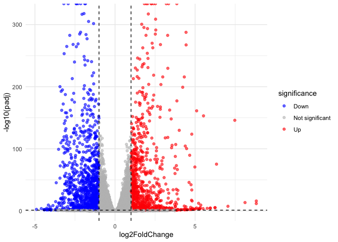
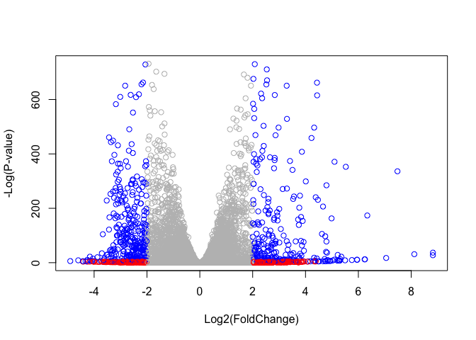

# Class 14: RNASeq mini project
Yuntian Zhu (PID: A17816597)

- [Background](#background)
- [Data Import](#data-import)
- [DESeq analysis](#deseq-analysis)
- [Data visualization](#data-visualization)
- [Add Annotation](#add-annotation)
- [Pathway Analysis](#pathway-analysis)
  - [GO terms](#go-terms)
  - [Reactome](#reactome)
- [Save our results](#save-our-results)

## Background

Here we work through a complete RNAseq analysis project. The input data
comes from a knock-down experiment of a HOX gene.

## Data Import

Reading the `counts` and `metadata` CSV files

``` r
counts <- read.csv("GSE37704_featurecounts.csv", row.names = 1)
countData <- read.csv("GSE37704_featurecounts.csv", row.names = 1)
metadata <- read.csv("GSE37704_metadata.csv")
```

Check on data structure

``` r
head(counts)
```

                    length SRR493366 SRR493367 SRR493368 SRR493369 SRR493370
    ENSG00000186092    918         0         0         0         0         0
    ENSG00000279928    718         0         0         0         0         0
    ENSG00000279457   1982        23        28        29        29        28
    ENSG00000278566    939         0         0         0         0         0
    ENSG00000273547    939         0         0         0         0         0
    ENSG00000187634   3214       124       123       205       207       212
                    SRR493371
    ENSG00000186092         0
    ENSG00000279928         0
    ENSG00000279457        46
    ENSG00000278566         0
    ENSG00000273547         0
    ENSG00000187634       258

``` r
metadata
```

             id     condition
    1 SRR493366 control_sirna
    2 SRR493367 control_sirna
    3 SRR493368 control_sirna
    4 SRR493369      hoxa1_kd
    5 SRR493370      hoxa1_kd
    6 SRR493371      hoxa1_kd

Some book-keeping is required as there looks to be a mismatch between
metadata and counts columns.

``` r
ncol(counts)
```

    [1] 7

``` r
nrow(metadata)
```

    [1] 6

Looks like we need to get rid of the first “length” column of our
`counts` object.

``` r
cleancounts <- counts[ , -1]
colnames(cleancounts)
```

    [1] "SRR493366" "SRR493367" "SRR493368" "SRR493369" "SRR493370" "SRR493371"

``` r
colnames (cleancounts) == metadata$id
```

    [1] TRUE TRUE TRUE TRUE TRUE TRUE

> Q1. Complete the code below to remove the troublesome first column
> from countData

``` r
# Note we need to remove the odd first $length col
countData <- as.matrix(countData[,-1])
head(countData)
```

                    SRR493366 SRR493367 SRR493368 SRR493369 SRR493370 SRR493371
    ENSG00000186092         0         0         0         0         0         0
    ENSG00000279928         0         0         0         0         0         0
    ENSG00000279457        23        28        29        29        28        46
    ENSG00000278566         0         0         0         0         0         0
    ENSG00000273547         0         0         0         0         0         0
    ENSG00000187634       124       123       205       207       212       258

\##Remove zero count genes

There are lots of genes with zero counts

> Q2. Complete the code below to filter countData to exclude genes
> (i.e. rows) where we have 0 read count across all samples
> (i.e. columns).

``` r
countData = countData[rowSums(countData) > 0, ]
```

``` r
head(cleancounts)
```

                    SRR493366 SRR493367 SRR493368 SRR493369 SRR493370 SRR493371
    ENSG00000186092         0         0         0         0         0         0
    ENSG00000279928         0         0         0         0         0         0
    ENSG00000279457        23        28        29        29        28        46
    ENSG00000278566         0         0         0         0         0         0
    ENSG00000273547         0         0         0         0         0         0
    ENSG00000187634       124       123       205       207       212       258

``` r
to.keep.inds <- rowSums(cleancounts) > 0 
nonzero_counts <- cleancounts[to.keep.inds,]
```

## DESeq analysis

Load the package

``` r
library(DESeq2)
```

Set up DESeq

``` r
dds <- DESeqDataSetFromMatrix(countData = nonzero_counts, 
                              colData = metadata, 
                              design = ~condition)
```

    Warning in DESeqDataSet(se, design = design, ignoreRank): some variables in
    design formula are characters, converting to factors

Run DESeq

``` r
dds <- DESeq(dds)
```

    estimating size factors

    estimating dispersions

    gene-wise dispersion estimates

    mean-dispersion relationship

    final dispersion estimates

    fitting model and testing

Get results

``` r
res <- results(dds)
res
```

    log2 fold change (MLE): condition hoxa1 kd vs control sirna 
    Wald test p-value: condition hoxa1 kd vs control sirna 
    DataFrame with 15975 rows and 6 columns
                     baseMean log2FoldChange     lfcSE       stat      pvalue
                    <numeric>      <numeric> <numeric>  <numeric>   <numeric>
    ENSG00000279457   29.9136      0.1792571 0.3248215   0.551863 5.81042e-01
    ENSG00000187634  183.2296      0.4264571 0.1402658   3.040350 2.36304e-03
    ENSG00000188976 1651.1881     -0.6927205 0.0548465 -12.630156 1.43993e-36
    ENSG00000187961  209.6379      0.7297556 0.1318599   5.534326 3.12428e-08
    ENSG00000187583   47.2551      0.0405765 0.2718928   0.149237 8.81366e-01
    ...                   ...            ...       ...        ...         ...
    ENSG00000273748  35.30265       0.674387  0.303666   2.220817 2.63633e-02
    ENSG00000278817   2.42302      -0.388988  1.130394  -0.344118 7.30758e-01
    ENSG00000278384   1.10180       0.332991  1.660261   0.200565 8.41039e-01
    ENSG00000276345  73.64496      -0.356181  0.207716  -1.714752 8.63908e-02
    ENSG00000271254 181.59590      -0.609667  0.141320  -4.314071 1.60276e-05
                           padj
                      <numeric>
    ENSG00000279457 6.86555e-01
    ENSG00000187634 5.15718e-03
    ENSG00000188976 1.76553e-35
    ENSG00000187961 1.13413e-07
    ENSG00000187583 9.19031e-01
    ...                     ...
    ENSG00000273748 4.79091e-02
    ENSG00000278817 8.09772e-01
    ENSG00000278384 8.92654e-01
    ENSG00000276345 1.39761e-01
    ENSG00000271254 4.53647e-05

> Q3. Call the summary() function on your results to get a sense of how
> many genes are up or down-regulated at the default 0.1 p-value cutoff.

``` r
summary(res)
```


    out of 15975 with nonzero total read count
    adjusted p-value < 0.1
    LFC > 0 (up)       : 4349, 27%
    LFC < 0 (down)     : 4396, 28%
    outliers [1]       : 0, 0%
    low counts [2]     : 1237, 7.7%
    (mean count < 0)
    [1] see 'cooksCutoff' argument of ?results
    [2] see 'independentFiltering' argument of ?results

## Data visualization

Volcano plot

``` r
library(ggplot2)

ggplot(res) + 
  aes(log2FoldChange, -log(padj)) +
  geom_point()
```

    Warning: Removed 1237 rows containing missing values or values outside the scale range
    (`geom_point()`).


Add threshhold lines for fold-change and p-Value and color our subset of
genes

``` r
res$significance <- "Not significant"
res$significance[res$padj < 0.05 & res$log2FoldChange > 1]  <- "Up"
res$significance[res$padj < 0.05 & res$log2FoldChange < -1] <- "Down"

ggplot(res, aes(x = log2FoldChange, y = -log10(padj), color = significance)) +
  geom_point(alpha = 0.6) +
  geom_vline(xintercept = c(-1, 1), linetype = "dashed") +
  geom_hline(yintercept = -log10(0.05), linetype = "dashed") +
  scale_color_manual(values = c("blue", "grey", "red")) +
  theme_minimal()
```

    Warning: Removed 1237 rows containing missing values or values outside the scale range
    (`geom_point()`).



> Q4. Improve this plot by completing the below code, which adds color
> and axis labels

``` r
# Make a color vector for all genes
mycols <- rep("gray", nrow(res))

# Color red the genes with absolute fold change above 2
mycols[ abs(res$log2FoldChange) > 2 ] <- "red"

# Color blue those with adjusted p-value less than 0.01
# and absolute fold change more than 2
inds <- (res$padj < 0.01) & (abs(res$log2FoldChange) > 2)
mycols[ inds ] <- "blue"

plot(
  res$log2FoldChange,
  -log(res$padj),
  col = mycols,
  xlab = "Log2(FoldChange)",
  ylab = "-Log(P-value)"
)
```



## Add Annotation

Add gene symbols and entrez IDs

``` r
library(AnnotationDbi)
library(org.Hs.eg.db)
```

``` r
res$symbol <- mapIds(x = org.Hs.eg.db,
       keys = row.names(res),
       keytype = "ENSEMBL",
       column = "SYMBOL")
```

    'select()' returned 1:many mapping between keys and columns

``` r
res$entrez <- mapIds(x = org.Hs.eg.db,
       keys = row.names(res),
       keytype = "ENSEMBL",
       column = "ENTREZID")
```

    'select()' returned 1:many mapping between keys and columns

> Q5. Use the mapIDs() function multiple times to add SYMBOL, ENTREZID
> and GENENAME annotation to our results by completing the code below.

``` r
library("AnnotationDbi")
library("org.Hs.eg.db")

columns(org.Hs.eg.db)
```

     [1] "ACCNUM"       "ALIAS"        "ENSEMBL"      "ENSEMBLPROT"  "ENSEMBLTRANS"
     [6] "ENTREZID"     "ENZYME"       "EVIDENCE"     "EVIDENCEALL"  "GENENAME"    
    [11] "GENETYPE"     "GO"           "GOALL"        "IPI"          "MAP"         
    [16] "OMIM"         "ONTOLOGY"     "ONTOLOGYALL"  "PATH"         "PFAM"        
    [21] "PMID"         "PROSITE"      "REFSEQ"       "SYMBOL"       "UCSCKG"      
    [26] "UNIPROT"     

``` r
res$symbol = mapIds(org.Hs.eg.db,
    keys = row.names(res),
    keytype = "ENSEMBL",
    column = "SYMBOL",
    multiVals = "first")
```

    'select()' returned 1:many mapping between keys and columns

``` r
res$entrez = mapIds(org.Hs.eg.db,
    keys = row.names(res),
    keytype = "ENSEMBL",
    column = "ENTREZID",
    multiVals = "first")
```

    'select()' returned 1:many mapping between keys and columns

``` r
res$name = mapIds(org.Hs.eg.db,
    keys = row.names(res),
    keytype = "ENSEMBL",
    column = "GENENAME",
    multiVals = "first")
```

    'select()' returned 1:many mapping between keys and columns

``` r
head(res, 10)
```

    log2 fold change (MLE): condition hoxa1 kd vs control sirna 
    Wald test p-value: condition hoxa1 kd vs control sirna 
    DataFrame with 10 rows and 10 columns
                       baseMean log2FoldChange     lfcSE       stat      pvalue
                      <numeric>      <numeric> <numeric>  <numeric>   <numeric>
    ENSG00000279457   29.913579      0.1792571 0.3248215   0.551863 5.81042e-01
    ENSG00000187634  183.229650      0.4264571 0.1402658   3.040350 2.36304e-03
    ENSG00000188976 1651.188076     -0.6927205 0.0548465 -12.630156 1.43993e-36
    ENSG00000187961  209.637938      0.7297556 0.1318599   5.534326 3.12428e-08
    ENSG00000187583   47.255123      0.0405765 0.2718928   0.149237 8.81366e-01
    ENSG00000187642   11.979750      0.5428105 0.5215598   1.040744 2.97994e-01
    ENSG00000188290  108.922128      2.0570638 0.1969053  10.446970 1.51281e-25
    ENSG00000187608  350.716868      0.2573837 0.1027266   2.505522 1.22271e-02
    ENSG00000188157 9128.439422      0.3899088 0.0467164   8.346302 7.04333e-17
    ENSG00000237330    0.158192      0.7859552 4.0804729   0.192614 8.47261e-01
                           padj    significance      symbol      entrez
                      <numeric>     <character> <character> <character>
    ENSG00000279457 6.86555e-01 Not significant          NA          NA
    ENSG00000187634 5.15718e-03 Not significant      SAMD11      148398
    ENSG00000188976 1.76553e-35 Not significant       NOC2L       26155
    ENSG00000187961 1.13413e-07 Not significant      KLHL17      339451
    ENSG00000187583 9.19031e-01 Not significant     PLEKHN1       84069
    ENSG00000187642 4.03379e-01 Not significant       PERM1       84808
    ENSG00000188290 1.30538e-24              Up        HES4       57801
    ENSG00000187608 2.37452e-02 Not significant       ISG15        9636
    ENSG00000188157 4.21970e-16 Not significant        AGRN      375790
    ENSG00000237330          NA Not significant      RNF223      401934
                                      name
                               <character>
    ENSG00000279457                     NA
    ENSG00000187634 sterile alpha motif ..
    ENSG00000188976 NOC2 like nucleolar ..
    ENSG00000187961 kelch like family me..
    ENSG00000187583 pleckstrin homology ..
    ENSG00000187642 PPARGC1 and ESRR ind..
    ENSG00000188290 hes family bHLH tran..
    ENSG00000187608 ISG15 ubiquitin like..
    ENSG00000188157                  agrin
    ENSG00000237330 ring finger protein ..

> Q6. Finally for this section let’s reorder these results by adjusted
> p-value and save them to a CSV file in your current project directory.

``` r
res = res[order(res$padj), ]
write.csv(res, file = "deseq_results.csv")
```

## Pathway Analysis

\###Run gage analysis with KEGG

``` r
library(gage)
library(gageData)
library(pathview)
```

We need a name vector for the input of gage

``` r
foldchanges <- res$log2FoldChange
names(foldchanges) <- res$entrez # We need to use Entrez ID here for KEGG
head(foldchanges)
```

         1266     54855      1465      2034      2150      6659 
    -2.422719  3.201955 -2.313738 -1.888019  3.344508  2.392288 

``` r
data(kegg.sets.hs)
keggres = gage(foldchanges, gsets = kegg.sets.hs)
```

``` r
head(keggres$less, 5)
```

                                                      p.geomean stat.mean
    hsa04110 Cell cycle                            8.995727e-06 -4.378644
    hsa03030 DNA replication                       9.424076e-05 -3.951803
    hsa05130 Pathogenic Escherichia coli infection 1.405864e-04 -3.765330
    hsa03013 RNA transport                         1.375901e-03 -3.028500
    hsa03440 Homologous recombination              3.066756e-03 -2.852899
                                                          p.val       q.val
    hsa04110 Cell cycle                            8.995727e-06 0.001889103
    hsa03030 DNA replication                       9.424076e-05 0.009841047
    hsa05130 Pathogenic Escherichia coli infection 1.405864e-04 0.009841047
    hsa03013 RNA transport                         1.375901e-03 0.072234819
    hsa03440 Homologous recombination              3.066756e-03 0.128803765
                                                   set.size         exp1
    hsa04110 Cell cycle                                 121 8.995727e-06
    hsa03030 DNA replication                             36 9.424076e-05
    hsa05130 Pathogenic Escherichia coli infection       53 1.405864e-04
    hsa03013 RNA transport                              144 1.375901e-03
    hsa03440 Homologous recombination                    28 3.066756e-03

``` r
head(keggres$greater, 5)
```

                                                       p.geomean stat.mean
    hsa04060 Cytokine-cytokine receptor interaction 9.131044e-06  4.358967
    hsa05323 Rheumatoid arthritis                   1.809824e-04  3.666793
    hsa05146 Amoebiasis                             1.313400e-03  3.052596
    hsa05332 Graft-versus-host disease              2.605234e-03  2.948229
    hsa04640 Hematopoietic cell lineage             2.822776e-03  2.833362
                                                           p.val       q.val
    hsa04060 Cytokine-cytokine receptor interaction 9.131044e-06 0.001917519
    hsa05323 Rheumatoid arthritis                   1.809824e-04 0.019003147
    hsa05146 Amoebiasis                             1.313400e-03 0.091937999
    hsa05332 Graft-versus-host disease              2.605234e-03 0.118556573
    hsa04640 Hematopoietic cell lineage             2.822776e-03 0.118556573
                                                    set.size         exp1
    hsa04060 Cytokine-cytokine receptor interaction      177 9.131044e-06
    hsa05323 Rheumatoid arthritis                         72 1.809824e-04
    hsa05146 Amoebiasis                                   94 1.313400e-03
    hsa05332 Graft-versus-host disease                    22 2.605234e-03
    hsa04640 Hematopoietic cell lineage                   55 2.822776e-03

``` r
pathview(pathway.id = "hsa04110", gene.data = foldchanges)
```

    'select()' returned 1:1 mapping between keys and columns

    Info: Working in directory /Users/apple/Desktop/UCSD/BIMM 143/BIMM143_Github_YTZhu/Class14

    Info: Writing image file hsa04110.pathview.png


``` r
pathview(pathway.id = "hsa03030", gene.data = foldchanges)
```

    'select()' returned 1:1 mapping between keys and columns

    Info: Working in directory /Users/apple/Desktop/UCSD/BIMM 143/BIMM143_Github_YTZhu/Class14

    Info: Writing image file hsa03030.pathview.png


> Q7. Can you do the same procedure as above to plot the pathview
> figures for the top 5 down-reguled pathways?

``` r
## Focus on top 5 down-regulated pathways
keggrespathways_down <- rownames(keggres$less)[1:5]

## Extract the 8-character KEGG pathway IDs (e.g., "hsa04110")
keggresids_down <- substr(keggrespathways_down, start = 1, stop = 8)

keggresids_down
```

    [1] "hsa04110" "hsa03030" "hsa05130" "hsa03013" "hsa03440"

``` r
pathview(
    gene.data = foldchanges,
    pathway.id = keggresids_down,
    species = "hsa"
)
```

    'select()' returned 1:1 mapping between keys and columns

    Info: Working in directory /Users/apple/Desktop/UCSD/BIMM 143/BIMM143_Github_YTZhu/Class14

    Info: Writing image file hsa04110.pathview.png

    'select()' returned 1:1 mapping between keys and columns

    Info: Working in directory /Users/apple/Desktop/UCSD/BIMM 143/BIMM143_Github_YTZhu/Class14

    Info: Writing image file hsa03030.pathview.png

    'select()' returned 1:1 mapping between keys and columns

    Info: Working in directory /Users/apple/Desktop/UCSD/BIMM 143/BIMM143_Github_YTZhu/Class14

    Info: Writing image file hsa05130.pathview.png

    'select()' returned 1:1 mapping between keys and columns

    Info: Working in directory /Users/apple/Desktop/UCSD/BIMM 143/BIMM143_Github_YTZhu/Class14

    Info: Writing image file hsa03013.pathview.png

    'select()' returned 1:1 mapping between keys and columns

    Info: Working in directory /Users/apple/Desktop/UCSD/BIMM 143/BIMM143_Github_YTZhu/Class14

    Info: Writing image file hsa03440.pathview.png


### GO terms

Same analysis but using GO geneset rather than KEGG

``` r
data(go.sets.hs)
data(go.subs.hs)

# Focus on Biological Process subset of GO
gobpsets = go.sets.hs[go.subs.hs$BP]

gobpres = gage(foldchanges, gsets=gobpsets, same.dir=TRUE)

lapply(gobpres, head)
```

    $greater
                                                 p.geomean stat.mean        p.val
    GO:0007156 homophilic cell adhesion       8.519724e-05  3.824205 8.519724e-05
    GO:0002009 morphogenesis of an epithelium 1.396681e-04  3.653886 1.396681e-04
    GO:0048729 tissue morphogenesis           1.432451e-04  3.643242 1.432451e-04
    GO:0007610 behavior                       1.925222e-04  3.565432 1.925222e-04
    GO:0060562 epithelial tube morphogenesis  5.932837e-04  3.261376 5.932837e-04
    GO:0035295 tube development               5.953254e-04  3.253665 5.953254e-04
                                                  q.val set.size         exp1
    GO:0007156 homophilic cell adhesion       0.1951953      113 8.519724e-05
    GO:0002009 morphogenesis of an epithelium 0.1951953      339 1.396681e-04
    GO:0048729 tissue morphogenesis           0.1951953      424 1.432451e-04
    GO:0007610 behavior                       0.1967577      426 1.925222e-04
    GO:0060562 epithelial tube morphogenesis  0.3565320      257 5.932837e-04
    GO:0035295 tube development               0.3565320      391 5.953254e-04

    $less
                                                p.geomean stat.mean        p.val
    GO:0048285 organelle fission             1.536227e-15 -8.063910 1.536227e-15
    GO:0000280 nuclear division              4.286961e-15 -7.939217 4.286961e-15
    GO:0007067 mitosis                       4.286961e-15 -7.939217 4.286961e-15
    GO:0000087 M phase of mitotic cell cycle 1.169934e-14 -7.797496 1.169934e-14
    GO:0007059 chromosome segregation        2.028624e-11 -6.878340 2.028624e-11
    GO:0000236 mitotic prometaphase          1.729553e-10 -6.695966 1.729553e-10
                                                    q.val set.size         exp1
    GO:0048285 organelle fission             5.841698e-12      376 1.536227e-15
    GO:0000280 nuclear division              5.841698e-12      352 4.286961e-15
    GO:0007067 mitosis                       5.841698e-12      352 4.286961e-15
    GO:0000087 M phase of mitotic cell cycle 1.195672e-11      362 1.169934e-14
    GO:0007059 chromosome segregation        1.658603e-08      142 2.028624e-11
    GO:0000236 mitotic prometaphase          1.178402e-07       84 1.729553e-10

    $stats
                                              stat.mean     exp1
    GO:0007156 homophilic cell adhesion        3.824205 3.824205
    GO:0002009 morphogenesis of an epithelium  3.653886 3.653886
    GO:0048729 tissue morphogenesis            3.643242 3.643242
    GO:0007610 behavior                        3.565432 3.565432
    GO:0060562 epithelial tube morphogenesis   3.261376 3.261376
    GO:0035295 tube development                3.253665 3.253665

### Reactome

We can analyze the reactome using web interfaces or R functions.

The website is <https://reactome.org/>. It requires a text format withe
gene symbol per line of the genes you want to map to pathways

``` r
sig_genes <- res[res$padj <= 0.05 & !is.na(res$padj), "symbol"]
head(sig_genes)
```

    ENSG00000117519 ENSG00000183508 ENSG00000159176 ENSG00000116016 ENSG00000164251 
             "CNN3"        "TENT5C"         "CSRP1"         "EPAS1"         "F2RL1" 
    ENSG00000124766 
             "SOX4" 

Write it our to a file

``` r
write.table(sig_genes, file="significant_genes.txt", row.names=FALSE, col.names=FALSE, quote=FALSE)
```

> Q8. What pathway has the most significant “Entities p-value”? Do the
> most significant pathways listed match your previous KEGG results?
> What factors could cause differences between the two methods?

The pathway with the most significant “entities p-value” is “Cell
cycle”. Both KEGG and Reactome identify Cell Cycle and DNA replication /
mitotic processes as the most significantly enriched. Therefore, the
results of KEGG and Reactome largely agree with each other, but there
are still certain differences. This can be due to different pathway
definitions, curation methods, gene coverage, statistics and
classifications between KEGG and Reactome.

## Save our results

``` r
write.csv(res, file = "myresults.csv")
```
