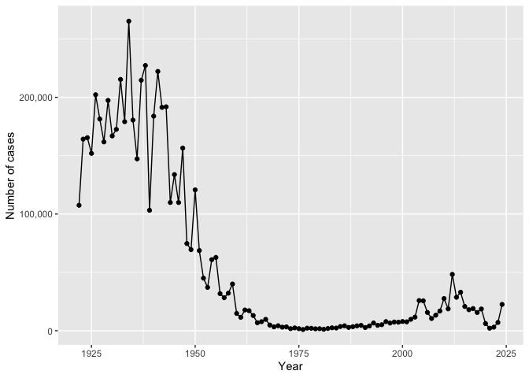
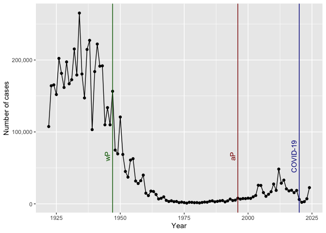
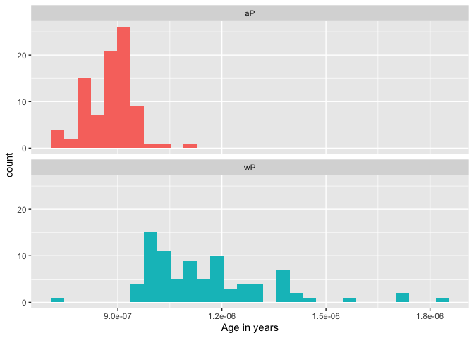
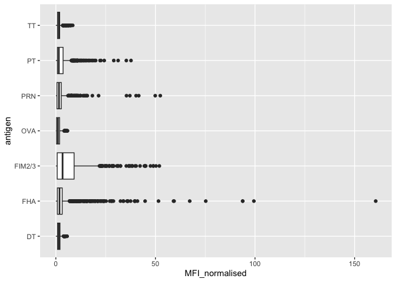
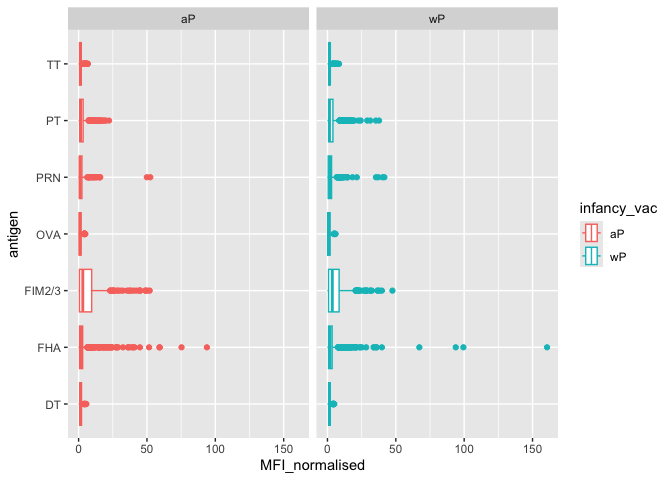
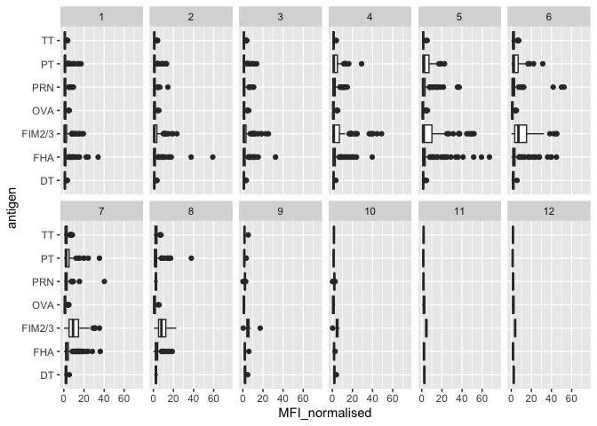
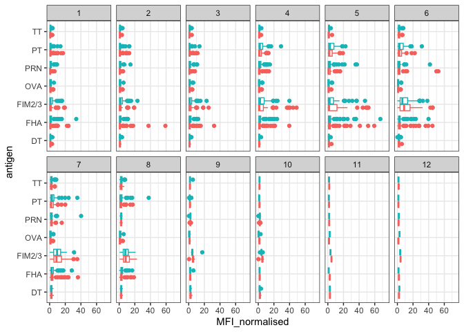
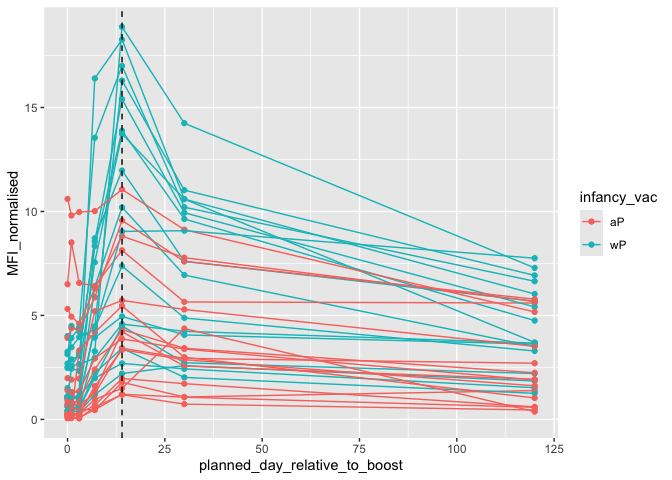

# Class19
Yuntian Zhu (PID: A17816597)

- [Background](#background)
- [The CMI-PB project](#the-cmi-pb-project)
- [Investigating the Age
  Differences](#investigating-the-age-differences)
- [Joining Multiple Tables](#joining-multiple-tables)
- [Examining IgG Ab Titer levels](#examining-igg-ab-titer-levels)

## Background

Pertussis is a bacterial lung infection also known as whooping cough.
Let’s begin by examining CDCD reported case numbers in the US.

> Q1. With the help of the R “addin” package datapasta assign the CDC
> pertussis case number data to a data frame called cdc and use ggplot
> to make a plot of cases numbers over time.

``` r
cdc <- data.frame(
                                 year = c(1922L,1923L,1924L,1925L,
                                          1926L,1927L,1928L,1929L,1930L,1931L,
                                          1932L,1933L,1934L,1935L,1936L,
                                          1937L,1938L,1939L,1940L,1941L,1942L,
                                          1943L,1944L,1945L,1946L,1947L,
                                          1948L,1949L,1950L,1951L,1952L,
                                          1953L,1954L,1955L,1956L,1957L,1958L,
                                          1959L,1960L,1961L,1962L,1963L,
                                          1964L,1965L,1966L,1967L,1968L,1969L,
                                          1970L,1971L,1972L,1973L,1974L,
                                          1975L,1976L,1977L,1978L,1979L,1980L,
                                          1981L,1982L,1983L,1984L,1985L,
                                          1986L,1987L,1988L,1989L,1990L,
                                          1991L,1992L,1993L,1994L,1995L,1996L,
                                          1997L,1998L,1999L,2000L,2001L,
                                          2002L,2003L,2004L,2005L,2006L,2007L,
                                          2008L,2009L,2010L,2011L,2012L,
                                          2013L,2014L,2015L,2016L,2017L,2018L,
                                          2019L,2020L,2021L,2022L,2023L, 2024L),
        cases = c(107473,164191,165418,152003,
                                          202210,181411,161799,197371,
                                          166914,172559,215343,179135,265269,
                                          180518,147237,214652,227319,103188,
                                          183866,222202,191383,191890,109873,
                                          133792,109860,156517,74715,69479,
                                          120718,68687,45030,37129,60886,
                                          62786,31732,28295,32148,40005,
                                          14809,11468,17749,17135,13005,6799,
                                          7717,9718,4810,3285,4249,3036,
                                          3287,1759,2402,1738,1010,2177,2063,
                                          1623,1730,1248,1895,2463,2276,
                                          3589,4195,2823,3450,4157,4570,
                                          2719,4083,6586,4617,5137,7796,6564,
                                          7405,7298,7867,7580,9771,11647,
                                          25827,25616,15632,10454,13278,
                                          16858,27550,18719,48277,28639,32971,
                                          20762,17972,18975,15609,18617,
                                          6124,2116,3044,7063, 22538)
       )
head (cdc)
```

      year  cases
    1 1922 107473
    2 1923 164191
    3 1924 165418
    4 1925 152003
    5 1926 202210
    6 1927 181411

We can check whether we can plot cases per year for pertussis in the US

``` r
library(scales)
library(ggplot2)
ggplot(cdc) +
  aes(year, cases) +
  geom_point() +
  geom_line() +
  scale_y_continuous(labels = comma) +
  labs(x = "Year",
       y = "Number of cases")
```



> Q2. Using the ggplot geom_vline() function add lines to your previous
> plot for the 1946 introduction of the wP vaccine and the 1996 switch
> to aP vaccine (see example in the hint below). What do you notice?

Add some major milestone timepoints to out plot.

``` r
ggplot(cdc) +
  aes(year, cases) +
  geom_point() +
  geom_line() +
  scale_y_continuous(labels = comma) +
  labs(x = "Year",
       y = "Number of cases") +

  # vertical lines
  geom_vline(xintercept = 1947, color = "darkgreen") +
  geom_vline(xintercept = 1996, color = "darkred") +
  geom_vline(xintercept = 2020, color = "darkblue") +

  # lower labels (25% up the plot)
  annotate("text", x = 1947, y = max(cdc$cases)*0.25,
           label = "wP", color = "darkgreen", angle = 90, vjust = -0.5) +
  annotate("text", x = 1996, y = max(cdc$cases)*0.25,
           label = "aP", color = "darkred", angle = 90, vjust = -0.5) +
  annotate("text", x = 2020, y = max(cdc$cases)*0.25,
           label = "COVID-19", color = "darkblue", angle = 90, vjust = -0.5)
```



What I noticed:

The full introduction of mandatory wP (whole-cell) pertussis
immunization in the mid 1940w leads to a dramatic reduction in case
numbers (from over 200,000 to 100s).

The switch to the aP (never acellular vaccine) leads to an increasing
number of cases, due to the fact that the immunity produced by aP is
generally weaker than wP. There may also be other factors contributing
to the increasing number of cases.

The 2020 lockdowns and social distancing measures resulted in a
decreasing number of cases.

> Q3. Describe what happened after the introduction of the aP vaccine?
> Do you have a possible explanation for the observed trend?

After the introduction of the acellular pertussis (aP) vaccine in 1996,
pertussis cases began rising again, with multiple outbreaks in the
following decades. One likely explanation is that the aP vaccine
produces weaker and more rapidly waning immunity compared to the older
whole-cell vaccine, allowing more transmission and susceptibility in
adolescents and adults. Additional contributors may include bacteria
evolution and improved diagnostic testing using PCR. Social factors,
including decreased vaccine uptake due to the modern anti-vaccine
movement, may also amplify the resurgence by weakening herd immunity.

## The CMI-PB project

The CMI-PB project website: https://www.cmi-pb.org. The mission of
CMI-PB is to provide the scientific community with a comprehensive,
high-quality and freely accessible resource of Pertussis booster
vaccination.

They make their data available via JSON format API endpoints – basically
the database tables in a key::value type format. To read this, we can
use the `read_jason()` function from the **jsonlite** package.

``` r
library (jsonlite)

subject <- read_json(path = "https://www.cmi-pb.org/api/v5_1/subject"
                     , simplifyVector = TRUE)

head (subject)
```

      subject_id infancy_vac biological_sex              ethnicity  race
    1          1          wP         Female Not Hispanic or Latino White
    2          2          wP         Female Not Hispanic or Latino White
    3          3          wP         Female                Unknown White
    4          4          wP           Male Not Hispanic or Latino Asian
    5          5          wP           Male Not Hispanic or Latino Asian
    6          6          wP         Female Not Hispanic or Latino White
      year_of_birth date_of_boost      dataset
    1    1986-01-01    2016-09-12 2020_dataset
    2    1968-01-01    2019-01-28 2020_dataset
    3    1983-01-01    2016-10-10 2020_dataset
    4    1988-01-01    2016-08-29 2020_dataset
    5    1991-01-01    2016-08-29 2020_dataset
    6    1988-01-01    2016-10-10 2020_dataset

Q. How many individuals are in this dataset?

``` r
nrow(subject)
```

    [1] 172

> Q4. How many aP and wP infancy vaccinated subjects are in the dataset?

``` r
table(subject$infancy_vac)
```


    aP wP 
    87 85 

> Q5. How many Male and Female subjects/patients are in the dataset?

``` r
table(subject$biological_sex)
```


    Female   Male 
       112     60 

Q. What is the breakdown of race?

``` r
table(subject$race)
```


                American Indian/Alaska Native 
                                            1 
                                        Asian 
                                           44 
                    Black or African American 
                                            5 
                           More Than One Race 
                                           19 
    Native Hawaiian or Other Pacific Islander 
                                            2 
                      Unknown or Not Reported 
                                           21 
                                        White 
                                           80 

> Q6. What is the breakdown of race and biological sex (e.g. number of
> Asian females, White males etc…)?

``` r
table(subject$race, subject$biological_sex)
```

                                               
                                                Female Male
      American Indian/Alaska Native                  0    1
      Asian                                         32   12
      Black or African American                      2    3
      More Than One Race                            15    4
      Native Hawaiian or Other Pacific Islander      1    1
      Unknown or Not Reported                       14    7
      White                                         48   32

This breakdown is not particular representative of the US population.

## Investigating the Age Differences

> Q7. Using this approach determine (i) the average age of wP
> individuals, (ii) the average age of aP individuals; and (iii) are
> they significantly different?

``` r
library(dplyr)
```


    Attaching package: 'dplyr'

    The following objects are masked from 'package:stats':

        filter, lag

    The following objects are masked from 'package:base':

        intersect, setdiff, setequal, union

``` r
library(lubridate)
```


    Attaching package: 'lubridate'

    The following objects are masked from 'package:base':

        date, intersect, setdiff, union

``` r
subject <- subject %>%
  mutate(age = time_length(today() - ymd(year_of_birth), "years"))

subject %>%
  group_by(infancy_vac) %>%  
  summarise(avg_age = mean(age, na.rm = TRUE))
```

    # A tibble: 2 × 2
      infancy_vac avg_age
      <chr>         <dbl>
    1 aP             27.8
    2 wP             36.6

The average age of wP individuals is 36.57 years old. The average age of
aP individuals is 27.82 years old.

``` r
x <- t.test(age ~ infancy_vac, data = subject)
x$p.value
```

    [1] 2.372101e-23

A t-test indicates that the p value is 2.37e-23, far below the common
0.05 cutoff. Therefore, the ages of aP and wP individuals are
statistically significantly different.

> Q8. Determine the age of all individuals at time of boost?

``` r
int <- ymd(subject$date_of_boost) - ymd(subject$year_of_birth)
age_at_boost <- time_length(int, "year")
head(age_at_boost)
```

    [1] 30.69678 51.07461 33.77413 28.65982 25.65914 28.77481

> Q9. With the help of a faceted boxplot or histogram (see below), do
> you think these two groups are significantly different?

``` r
ggplot(subject) +
  aes(time_length(age, "year"),
      fill=as.factor(infancy_vac)) +
  geom_histogram(show.legend=FALSE) +
  facet_wrap(vars(infancy_vac), nrow=2) +
  xlab("Age in years")
```

    `stat_bin()` using `bins = 30`. Pick better value `binwidth`.



``` r
t.test(age ~ infancy_vac, data = subject)
```


        Welch Two Sample t-test

    data:  age by infancy_vac
    t = -12.918, df = 104.03, p-value < 2.2e-16
    alternative hypothesis: true difference in means between group aP and group wP is not equal to 0
    95 percent confidence interval:
     -10.094058  -7.407351
    sample estimates:
    mean in group aP mean in group wP 
            27.82006         36.57076 

``` r
x$p.value
```

    [1] 2.372101e-23

The aP and wP groups differ very strongly in age. The histogram shows
that the aP participants cluster tightly around their mid-20s to early
30s, whereas the wP group is substantially older and has a much wider
age range extending into the 40s and 50s. A formal Welch two-sample
t-test confirms this visual impression, yielding an extremely small
p-value (p = 2.37e-23), indicating that the age distributions of the two
groups are statistically different.

## Joining Multiple Tables

``` r
specimen <- read_json("https://www.cmi-pb.org/api/v5_1/specimen"
                      , simplifyVector = T)
ab_titer <- read_json("https://www.cmi-pb.org/api/v5_1/plasma_ab_titer"
                      , simplifyVector = T)
```

``` r
head(specimen)
```

      specimen_id subject_id actual_day_relative_to_boost
    1           1          1                           -3
    2           2          1                            1
    3           3          1                            3
    4           4          1                            7
    5           5          1                           11
    6           6          1                           32
      planned_day_relative_to_boost specimen_type visit
    1                             0         Blood     1
    2                             1         Blood     2
    3                             3         Blood     3
    4                             7         Blood     4
    5                            14         Blood     5
    6                            30         Blood     6

``` r
head(ab_titer)
```

      specimen_id isotype is_antigen_specific antigen        MFI MFI_normalised
    1           1     IgE               FALSE   Total 1110.21154       2.493425
    2           1     IgE               FALSE   Total 2708.91616       2.493425
    3           1     IgG                TRUE      PT   68.56614       3.736992
    4           1     IgG                TRUE     PRN  332.12718       2.602350
    5           1     IgG                TRUE     FHA 1887.12263      34.050956
    6           1     IgE                TRUE     ACT    0.10000       1.000000
       unit lower_limit_of_detection
    1 UG/ML                 2.096133
    2 IU/ML                29.170000
    3 IU/ML                 0.530000
    4 IU/ML                 6.205949
    5 IU/ML                 4.679535
    6 IU/ML                 2.816431

We need to link these tables with the `subject` table, so we can begin
to analyze the data and know who a given Ab sample was collected from
and when.

> Q9. Complete the code to join specimen and subject tables to make a
> new merged data frame containing all specimen records along with their
> associated subject details:

``` r
meta <- inner_join(subject, specimen)
```

    Joining with `by = join_by(subject_id)`

``` r
dim(meta)
```

    [1] 1503   14

``` r
head(meta)
```

      subject_id infancy_vac biological_sex              ethnicity  race
    1          1          wP         Female Not Hispanic or Latino White
    2          1          wP         Female Not Hispanic or Latino White
    3          1          wP         Female Not Hispanic or Latino White
    4          1          wP         Female Not Hispanic or Latino White
    5          1          wP         Female Not Hispanic or Latino White
    6          1          wP         Female Not Hispanic or Latino White
      year_of_birth date_of_boost      dataset      age specimen_id
    1    1986-01-01    2016-09-12 2020_dataset 39.92334           1
    2    1986-01-01    2016-09-12 2020_dataset 39.92334           2
    3    1986-01-01    2016-09-12 2020_dataset 39.92334           3
    4    1986-01-01    2016-09-12 2020_dataset 39.92334           4
    5    1986-01-01    2016-09-12 2020_dataset 39.92334           5
    6    1986-01-01    2016-09-12 2020_dataset 39.92334           6
      actual_day_relative_to_boost planned_day_relative_to_boost specimen_type
    1                           -3                             0         Blood
    2                            1                             1         Blood
    3                            3                             3         Blood
    4                            7                             7         Blood
    5                           11                            14         Blood
    6                           32                            30         Blood
      visit
    1     1
    2     2
    3     3
    4     4
    5     5
    6     6

Now, let’s also join the `ab_titer` table with the `meta` table.

> Q10. Now using the same procedure join meta with titer data so we can
> further analyze this data in terms of time of visit aP/wP, male/female
> etc.

``` r
ab_data <- inner_join(meta, ab_titer)
```

    Joining with `by = join_by(specimen_id)`

``` r
dim(ab_data)
```

    [1] 61956    21

``` r
head(ab_data)
```

      subject_id infancy_vac biological_sex              ethnicity  race
    1          1          wP         Female Not Hispanic or Latino White
    2          1          wP         Female Not Hispanic or Latino White
    3          1          wP         Female Not Hispanic or Latino White
    4          1          wP         Female Not Hispanic or Latino White
    5          1          wP         Female Not Hispanic or Latino White
    6          1          wP         Female Not Hispanic or Latino White
      year_of_birth date_of_boost      dataset      age specimen_id
    1    1986-01-01    2016-09-12 2020_dataset 39.92334           1
    2    1986-01-01    2016-09-12 2020_dataset 39.92334           1
    3    1986-01-01    2016-09-12 2020_dataset 39.92334           1
    4    1986-01-01    2016-09-12 2020_dataset 39.92334           1
    5    1986-01-01    2016-09-12 2020_dataset 39.92334           1
    6    1986-01-01    2016-09-12 2020_dataset 39.92334           1
      actual_day_relative_to_boost planned_day_relative_to_boost specimen_type
    1                           -3                             0         Blood
    2                           -3                             0         Blood
    3                           -3                             0         Blood
    4                           -3                             0         Blood
    5                           -3                             0         Blood
    6                           -3                             0         Blood
      visit isotype is_antigen_specific antigen        MFI MFI_normalised  unit
    1     1     IgE               FALSE   Total 1110.21154       2.493425 UG/ML
    2     1     IgE               FALSE   Total 2708.91616       2.493425 IU/ML
    3     1     IgG                TRUE      PT   68.56614       3.736992 IU/ML
    4     1     IgG                TRUE     PRN  332.12718       2.602350 IU/ML
    5     1     IgG                TRUE     FHA 1887.12263      34.050956 IU/ML
    6     1     IgE                TRUE     ACT    0.10000       1.000000 IU/ML
      lower_limit_of_detection
    1                 2.096133
    2                29.170000
    3                 0.530000
    4                 6.205949
    5                 4.679535
    6                 2.816431

Q. How many Ab measurements do we have in total?

``` r
nrow(ab_data)
```

    [1] 61956

Q. How many different isotypes (types of Ab) are in the dataset?

``` r
unique(ab_data$isotype)
```

    [1] "IgE"  "IgG"  "IgG1" "IgG2" "IgG3" "IgG4"

Q. How many different antigens?

``` r
unique(ab_data$antigen)
```

     [1] "Total"   "PT"      "PRN"     "FHA"     "ACT"     "LOS"     "FELD1"  
     [8] "BETV1"   "LOLP1"   "Measles" "PTM"     "FIM2/3"  "TT"      "DT"     
    [15] "OVA"     "PD1"    

> Q11. How many specimens (i.e. entries in abdata) do we have for each
> isotype?

``` r
table(ab_data$isotype)
```


      IgE   IgG  IgG1  IgG2  IgG3  IgG4 
     6698  7265 11993 12000 12000 12000 

> Q12. What are the different \$dataset values in ab_data and what do
> you notice about the number of rows for the most “recent” dataset?

``` r
table(ab_data$dataset)
```


    2020_dataset 2021_dataset 2022_dataset 2023_dataset 
           31520         8085         7301        15050 

The dataset column contains four values: 2020_dataset, 2021_dataset,
2022_dataset, and 2023_dataset. The number of rows differs greatly
across years: 2020 has by far the largest number of records (31,520),
while 2022 and 2021 are much smaller (~7–8k). Interestingly, the most
“recent” dataset (2023) does not have the largest number of rows – it
has only 15,050 entries, about half of 2020. This suggests that more
recent data collection has been reduced, is still incomplete or reflects
changes in sampling effort or assay prioritization.

## Examining IgG Ab Titer levels

``` r
ggplot(ab_data) +
  aes(MFI, antigen) +
  geom_boxplot()
```

    Warning: Removed 1 row containing non-finite outside the scale range
    (`stat_boxplot()`).


``` r
igg <- ab_data |>
  filter(isotype == "IgG")
```

``` r
ggplot(igg) +
  aes(MFI_normalised, antigen) +
  geom_boxplot()
```



We can “facet” our plot by wP vs aP

``` r
ggplot(igg) +
  aes(MFI_normalised, antigen, col = infancy_vac) +
  geom_boxplot() +
  facet_wrap(~infancy_vac)
```



> Q13. Complete the following code to make a summary boxplot of Ab titer
> levels (MFI) for all antigens:

``` r
ggplot(igg) +
  aes(MFI_normalised, antigen) +
  geom_boxplot() + 
    xlim(0,75) +
  facet_wrap(vars(visit), nrow=2)
```

    Warning: Removed 5 rows containing non-finite outside the scale range
    (`stat_boxplot()`).



> Q14. What antigens show differences in the level of IgG antibody
> titers recognizing them over time? Why these and not others?

Several pertussis-related antigens show clear changes in IgG levels over
time, particularly PT, PRN, FHA and FIM2/3. These antigens rise
noticeably after the early visits (around visits 4–7), showing boosted
antibody responses following vaccination, and then gradually decline,
reflecting antibody waning. In contrast, antigens like TT, DT and the
negative control OVA remain relatively constant across all visits,
showing no meaningful time-dependent change. This pattern occurs because
only the pertussis antigens (PT, PRN, FHA and FIM2/3) are present in the
Tdap booster dose administered during the study, whereas TT/DT were not
boosted and OVA is unrelated to vaccination. As a result, only
pertussis-specific antigens exhibit dynamic IgG responses over the
12-visit timeline.

We can also add some colors to the plots.

``` r
ggplot(igg) +
  aes(MFI_normalised, antigen, col=infancy_vac ) +
  geom_boxplot(show.legend = FALSE) + 
  facet_wrap(vars(visit), nrow=2) +
  xlim(0,75) +
  theme_bw()
```

    Warning: Removed 5 rows containing non-finite outside the scale range
    (`stat_boxplot()`).



More advanced analysis digging into individual antigen responses over
time

``` r
  filter(igg, antigen == "PT", dataset == "2021_dataset") |>
  ggplot() +
    aes(x=planned_day_relative_to_boost,
        y=MFI_normalised,
        col=infancy_vac,
        group=subject_id) +
    geom_point() +
    geom_line() +
  geom_vline(xintercept=14, linetype = "dashed")
```



This plot compares PT-specific IgG responses after boosting between
individuals primed in infancy with either whole-cell (wP) or acellular
(aP) pertussis vaccines. Antibody levels rise rapidly and peak at 14
days post-boost (vertical dashed line), then gradually decline. Across
the entire time course, wP-primed individuals show higher peak responses
and sustain higher antibody levels than aP-primed individuals,
demonstrating the more robust and durable recall immunity associated
with wP priming.
