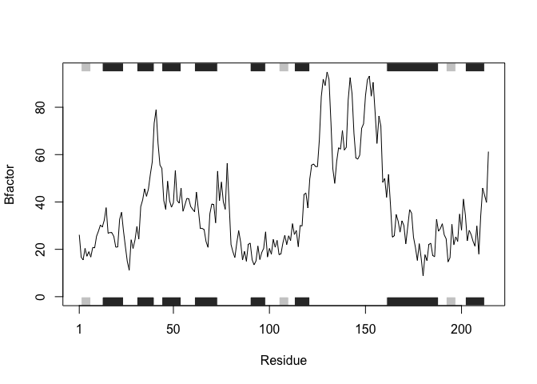
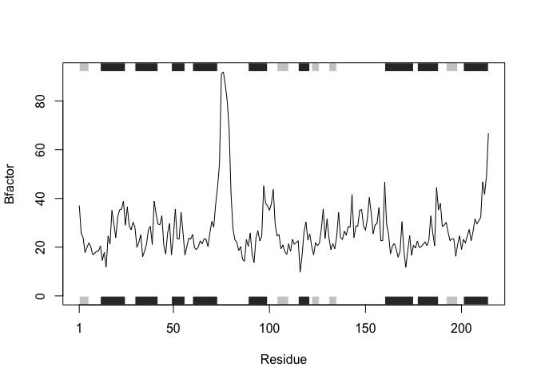

# Class6 Homework
Yuntian Zhu (PID: A17816597)

**I want to condense the codes in the supplement file to a function that
can be easily called**

``` r
# This function analyzes protein B-factor trends by:
# 1. Reading protein structure data from the Protein Data Bank (PDB)
# 2. Extracting a specified chain and atom type
# 3. Plotting B-factor values along the protein sequence
#
# Inputs:
#   pdbid - PDB ID of the protein 
#   chain - chain identifier to analyze (the default chain is "A")
#   elety - atom type to analyze (the default elety is "CA")
#
# Output: A plot showing B-factor trends with secondary structure annotations

plot_pdb_bfactor <- function (pdbid, chain = "A", elety = "CA"){
  
  #load the bio3d package
  library(bio3d)
  
  #read the structures in PDB with the PDB ID
  structure <- read.pdb(pdbid) 
  
  #extract one particular chain and the alpha carbon atoms
  structure.chain <- trim.pdb(structure, chain = chain, elety = elety) 
  
  #extract the B factors
  structure.bfactor <- structure.chain$atom$b 
  
  #plot B factors along the sequence and return the plot
  return(
    plotb3(structure.bfactor, 
           sse = structure.chain, 
           typ = "l", 
           ylab = "Bfactor")
    )
  
}
```

Test one with the ID 4AKE

``` r
plot_pdb_bfactor("4AKE")
```

      Note: Accessing on-line PDB file


Test two with the ID 4AKE and chain B

``` r
plot_pdb_bfactor("4AKE", chain = "B")
```

      Note: Accessing on-line PDB file

    Warning in get.pdb(file, path = tempdir(), verbose = FALSE):
    /var/folders/j9/c6jg3wlj0wx7jw6ws7j7znnw0000gn/T//RtmpJ38M0p/4AKE.pdb exists.
    Skipping download



Test three with the ID 1AKE

``` r
plot_pdb_bfactor("1AKE")
```

      Note: Accessing on-line PDB file
       PDB has ALT records, taking A only, rm.alt=TRUE


