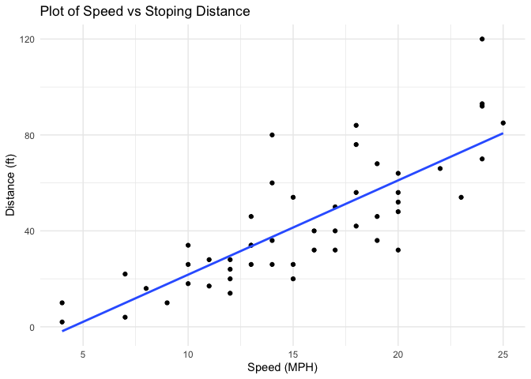
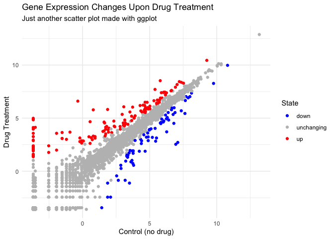
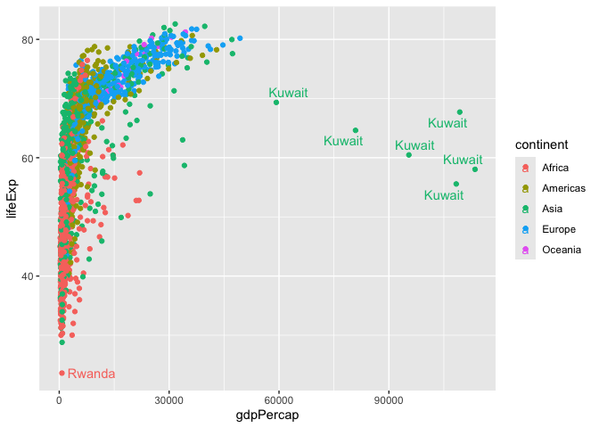
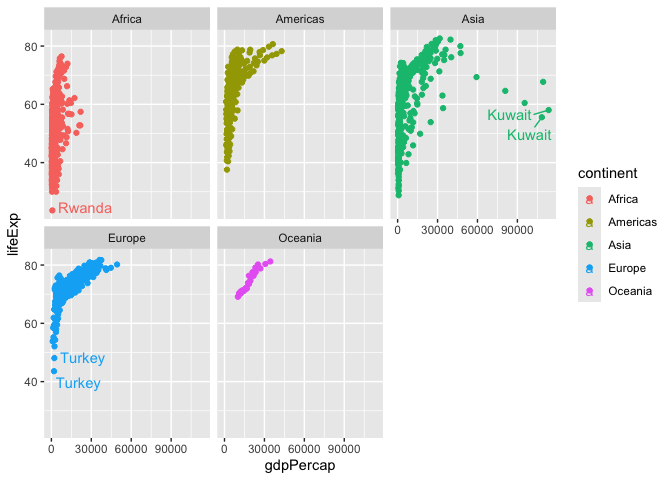

# Class 5: Data Viz with ggplot
Yuntian Zhu (PID: A17816597)

Today we are exploring the **ggplot** package and make nice figures in
R.

There are lots of ways to make figures and plots in R. These include:

- so called “base” R
- and add on packages lke **ggplot2**

Here is a simple “base” R plot.

``` r
head(cars)
```

      speed dist
    1     4    2
    2     4   10
    3     7    4
    4     7   22
    5     8   16
    6     9   10

We can simply pass to the `plot()` function.

``` r
plot(cars)
```


> Key-point: Base R is quick but not nice looking in some folk’s eyes.

Let’s see how we can plot this with **ggplot2**…

1st I need to install this add-on package. For this we use the
`install.packages()` function - \*\* WE DO THIS IN THE CONSOLE, NOT our
report\*\*. This is one time only deal.

2nd we need to load the package with `library()` function every time we
want to use it.

``` r
library(ggplot2)
ggplot(cars)
```


Every ggplot is composed of at least 3 layers:

- **data** (i.e. a data.frame with the things you want to plot)
- aesthetics **aes()** that map the columns of data to your features
- geoms like **geom_point()** that set how the plot appears

``` r
ggplot(cars) + aes(x = speed, y = dist) + geom_point()
```


> For simple “canned” graphs, base Ris quicker and more, but as things
> get more custom and elaborate, then ggplot wins out

Let’s add more layers to our ggplot

Add a line showing the relationship between x and y Add a title Add
custom axis labels “Speed (MPH)” and “Distance (ft)” Change the theme

``` r
ggplot(cars) + aes(x = speed, y = dist) + geom_point() + 
  geom_smooth(method = "lm", se = FALSE) + 
  labs(title = "Plot of Speed vs Stoping Distance", 
       x = "Speed (MPH)", y = "Distance (ft)") + theme_minimal()
```

    `geom_smooth()` using formula = 'y ~ x'



\##Going further

Read some gene expression data

``` r
url <- 
"https://bioboot.github.io/bimm143_S20/class-material/up_down_expression.txt"
genes <- read.delim(url)
head(genes)
```

            Gene Condition1 Condition2      State
    1      A4GNT -3.6808610 -3.4401355 unchanging
    2       AAAS  4.5479580  4.3864126 unchanging
    3      AASDH  3.7190695  3.4787276 unchanging
    4       AATF  5.0784720  5.0151916 unchanging
    5       AATK  0.4711421  0.5598642 unchanging
    6 AB015752.4 -3.6808610 -3.5921390 unchanging

> Q1. How many genes are in this wee dataset?

``` r
nrow(genes)
```

    [1] 5196

> Q2. How many upregulated genes are there?

``` r
sum(genes$State == "up")
```

    [1] 127

A useful function for counting up occurrences of things in a vector is
the `table()` function.

``` r
table(genes$State)
```


          down unchanging         up 
            72       4997        127 

Make a v1 figure

``` r
P <- ggplot(genes) + aes(x = Condition1, y = Condition2, col = State) + geom_point()
P
```


Change the color manually and add more layers

``` r
P + scale_color_manual(values = c("down" = "blue", "unchanging" = "gray", "up" = "red")) + 
  labs(
    title = "Gene Expression Changes Upon Drug Treatment",
    subtitle = "Just another scatter plot made with ggplot",
    x = "Control (no drug)",
    y = "Drug Treatment"
  ) +
  theme_minimal()
```



## More Plotting

Read the gapminder dataset

``` r
url <- 
"https://raw.githubusercontent.com/jennybc/gapminder/master/inst/extdata/gapminder.tsv"
gapminder <- read.delim(url)
```

Let’s have a wee peak

``` r
head(gapminder, 3)
```

          country continent year lifeExp      pop gdpPercap
    1 Afghanistan      Asia 1952  28.801  8425333  779.4453
    2 Afghanistan      Asia 1957  30.332  9240934  820.8530
    3 Afghanistan      Asia 1962  31.997 10267083  853.1007

> Q4. How many different country values are in this dataset?

``` r
length(table(gapminder$country))
```

    [1] 142

> Q. How many different continent values are in this dataset?

``` r
length(unique(gapminder$continent))
```

    [1] 5

Make a v1 plot

``` r
ggplot(gapminder) + aes (x = gdpPercap, y = lifeExp, col = continent, label = country) + 
  geom_point() + geom_text()
```


I can use **ggrepel** to make more sensible labels here

``` r
library (ggrepel)
ggplot(gapminder) + aes (x = gdpPercap, y = lifeExp, col = continent, label = country) + 
  geom_point() + geom_text_repel()
```

    Warning: ggrepel: 1697 unlabeled data points (too many overlaps). Consider
    increasing max.overlaps



I want a separate panel per continent

``` r
library (ggrepel)
ggplot(gapminder) + aes (x = gdpPercap, y = lifeExp, col = continent, label = country) + 
  geom_point() + geom_text_repel() + facet_wrap(~continent)
```

    Warning: ggrepel: 623 unlabeled data points (too many overlaps). Consider
    increasing max.overlaps

    Warning: ggrepel: 358 unlabeled data points (too many overlaps). Consider
    increasing max.overlaps

    Warning: ggrepel: 300 unlabeled data points (too many overlaps). Consider
    increasing max.overlaps

    Warning: ggrepel: 24 unlabeled data points (too many overlaps). Consider
    increasing max.overlaps

    Warning: ggrepel: 394 unlabeled data points (too many overlaps). Consider
    increasing max.overlaps



These are some advantages of ggplot over base R plot:

1.  **Publication-quality graphics by default:** ggplot produces
    visually appealing plots with sensible defaults, making it easier to
    create professional figures without extensive tweaking
    [\[5\]](https://drive.google.com/file/d/1BYSWJLROqxA1YpuDhJkzUolhiZqiOOKg/view?usp=drivesdk),
    [\[1\]](https://drive.google.com/file/d/1tFqKg9_nhVMmKYfiM1CQKDS2PmPwLh8n/view?usp=drivesdk).
2.  **Layered grammar of graphics:** You build plots by adding layers
    (data, aesthetics, geometries, annotations), which makes complex
    visualizations more systematic and reproducible
    [\[1\]](https://drive.google.com/file/d/1tFqKg9_nhVMmKYfiM1CQKDS2PmPwLh8n/view?usp=drivesdk),
    [\[4\]](https://drive.google.com/file/d/15xXaaIcCWOc_x1gJLdySWOd_sfMXTiaw/view?usp=drivesdk),
    [\[2\]](https://drive.google.com/file/d/1Clw2_EJ_hY3USNwObiPnxpIQIfirxfW0/view?usp=drivesdk).
3.  **Consistent syntax across plot types:** The same building blocks
    and functions are used for different plot types, reducing the need
    to learn new commands for each visualization
    [\[5\]](https://drive.google.com/file/d/1BYSWJLROqxA1YpuDhJkzUolhiZqiOOKg/view?usp=drivesdk),
    [\[1\]](https://drive.google.com/file/d/1tFqKg9_nhVMmKYfiM1CQKDS2PmPwLh8n/view?usp=drivesdk).
4.  **Easy customization:** Customizing colors, labels, legends, and
    themes is straightforward and can be done by adding layers
    [\[4\]](https://drive.google.com/file/d/15xXaaIcCWOc_x1gJLdySWOd_sfMXTiaw/view?usp=drivesdk),
    [\[2\]](https://drive.google.com/file/d/1Clw2_EJ_hY3USNwObiPnxpIQIfirxfW0/view?usp=drivesdk).
5.  **Faceting and mapping multiple variables:** ggplot makes it simple
    to split data into subplots (facets) and map multiple variables to
    color, shape, size, etc.
    [\[1\]](https://drive.google.com/file/d/1tFqKg9_nhVMmKYfiM1CQKDS2PmPwLh8n/view?usp=drivesdk),
    [\[2\]](https://drive.google.com/file/d/1Clw2_EJ_hY3USNwObiPnxpIQIfirxfW0/view?usp=drivesdk).
6.  **Extensibility:** Many additional packages and geoms are available,
    allowing for advanced and specialized visualizations
    [\[5\]](https://drive.google.com/file/d/1BYSWJLROqxA1YpuDhJkzUolhiZqiOOKg/view?usp=drivesdk),
    [\[1\]](https://drive.google.com/file/d/1tFqKg9_nhVMmKYfiM1CQKDS2PmPwLh8n/view?usp=drivesdk),
    [\[2\]](https://drive.google.com/file/d/1Clw2_EJ_hY3USNwObiPnxpIQIfirxfW0/view?usp=drivesdk).
7.  **Reproducibility:** ggplot code can be easily reused and modified
    for new datasets or analyses
    [\[5\]](https://drive.google.com/file/d/1BYSWJLROqxA1YpuDhJkzUolhiZqiOOKg/view?usp=drivesdk),
    [\[1\]](https://drive.google.com/file/d/1tFqKg9_nhVMmKYfiM1CQKDS2PmPwLh8n/view?usp=drivesdk).

**Acknowledgement: the text about the advantages of ggplot2 is generated
using TritonGPT on Oct14, 2025**
